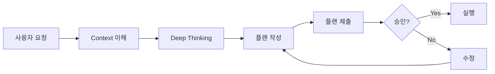

# 📋 플랜 제출 프로토콜 (Plan Submission Protocol)

## 🎯 목적
모든 작업 전 상세한 계획을 제출하고 승인받는 시스템

## 📊 플랜 제출 템플릿

### 1. Context 이해 확인
```markdown
## 🧠 Context 이해
- 사용자 요구사항: [상세 설명]
- 현재 상황: [환경, 자원, 제약]
- 성공 기준: [명확한 목표]
- 확인 질문: "제가 올바르게 이해했습니까?"
```

### 2. Deep Thinking Process
```markdown
## 🌳 Tree of Thought
- Branch 1: [옵션 A, B, C 비교]
- Branch 2: [대안 검토]
- 선택: [최종 선택과 이유]

## 💭 Chain of Thought
1. 문제 정의 → 2. 원인 분석 → 3. 해결 방법 → 4. 실행 계획 → 5. 검증 방법

## 🔍 대체 사고과정
- 검토한 대안: [다른 접근법들]
- 기각 이유: [왜 선택하지 않았는지]
```

### 3. 상세 실행 계획
```markdown
## 📅 Phase별 실행 계획
Phase 0: [준비 단계]
- 목표:
- 작업:
- 검증:
- 예상 시간:

Phase 1-N: [실행 단계들]
- 각 Phase별 상세 내용
- 실제 코드/스크립트 포함
- 검증 방법 명시
```

### 4. 위험 관리
```markdown
## 🚨 Risk Management
- Critical Risks: [치명적 위험]
- Mitigation: [완화 방안]
- Fallback: [실패시 대안]
```

### 5. 성공 지표
```markdown
## 📊 Success Metrics
| Phase | 목표 | 측정 방법 | 성공 기준 |
|-------|------|----------|----------|
```

### 6. 승인 요청
```markdown
## ❓ 승인 요청
**이 계획이 맞습니까?**
- [핵심 확인 사항 1]
- [핵심 확인 사항 2]
- [핵심 확인 사항 3]

**승인하시면 Phase 0부터 실행하겠습니다.**
```

## 🔄 플랜 제출 프로세스



## ⚡ 자동 트리거 상황

다음 상황에서는 자동으로 플랜 제출:
1. 새로운 프로젝트 시작
2. 대규모 작업 (100+ 파일)
3. 복잡한 통합 작업
4. 위험도 높은 작업
5. 사용자가 "계획" 언급시

## 📝 플랜 저장 위치

모든 제출된 플랜은 자동 저장:
```
K:\PortableApps\Claude-Code\plans\
├── YYYY-MM-DD-HH-MM-project-name.md
├── approved\  (승인된 플랜)
├── rejected\  (거절된 플랜)
└── executed\  (실행 완료된 플랜)
```

---
이 프로토콜은 CLAUDE.md의 일부로 통합되어 모든 작업에 적용됩니다.