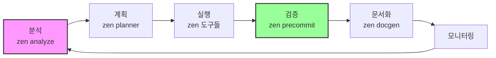

# 🚀 Zen MCP 방법론 - 실행 가이드

## 📋 즉시 적용 가능한 표준 워크플로우

### 1️⃣ 프로젝트 시작 워크플로우
```bash
# Step 1: BMAD 분석 (비즈니스 관점)
"BMAD 방법론으로 이 프로젝트의 비즈니스 요구사항을 분석해줘"

# Step 2: Zen 계획 수립 (기술 관점)
zen planner "Break down this project into manageable phases"

# Step 3: 아키텍처 분석
zen analyze "Understand the existing codebase architecture"

# Step 4: 심층 설계
zen thinkdeep "Architecture design with Gemini Pro"

# Step 5: 합의 도출
zen consensus "Get multiple AI perspectives on this approach"
```

### 2️⃣ 개발 워크플로우
```bash
# 코드 생성
zen chat "Generate implementation with GPT-5's creativity"

# 테스트 생성
zen testgen "Create comprehensive test suite"

# 리팩토링
zen refactor "Optimize for maintainability"

# 코드 리뷰
zen codereview "Security-focused review with Gemini Pro"
```

### 3️⃣ 품질 보증 워크플로우
```bash
# 보안 감사
zen secaudit "OWASP Top 10 vulnerability scan"

# 디버깅
zen debug "Complex issue analysis with O3's logic"

# 최종 검증
zen precommit "Final validation before deployment"

# 문서화
zen docgen "Generate comprehensive documentation"
```

## 🎯 모델별 최적 활용 매트릭스

| 작업 유형 | 최적 모델 | Zen 명령어 | 사용 시나리오 |
|-----------|----------|------------|---------------|
| **복잡한 분석** | Gemini Pro | `zen analyze` | 대규모 코드베이스, 아키텍처 |
| **빠른 작업** | Gemini Flash | `zen quick` | 포맷팅, 간단한 수정 |
| **논리적 디버깅** | OpenAI O3/O4 | `zen debug` | 복잡한 버그, 레이스 컨디션 |
| **창의적 솔루션** | GPT-5 | `zen chat` | 혁신적 접근, 새로운 패턴 |
| **보안 분석** | Gemini Pro | `zen secaudit` | OWASP, 취약점 스캔 |
| **합의 도출** | All Models | `zen consensus` | 중요한 결정, 다각도 검토 |

## 💡 실전 프롬프트 템플릿

### ❌ 잘못된 예시
```
"Review this code"
"Help me debug"
"Optimize this"
```

### ✅ 올바른 예시
```bash
# 보안 중심 리뷰
"Use zen codereview with Gemini Pro to perform a comprehensive 
security-focused review of the authentication module, 
prioritizing OWASP Top 10 vulnerabilities"

# 논리적 디버깅
"Debug this race condition with zen using O3's logical reasoning, 
focusing on concurrent data access patterns in session management"

# 아키텍처 최적화
"Use zen thinkdeep with Gemini Pro to analyze and suggest 
microservices decomposition for this monolithic application"
```

## 🔄 지속적 개선 사이클 (CI/CD for AI)



## 📊 성과 측정 KPI

| 지표 | 측정 방법 | 목표 |
|------|----------|------|
| **코드 품질** | zen codereview 점수 | 90+ |
| **보안 수준** | zen secaudit 이슈 | <5 |
| **테스트 커버리지** | zen testgen 통과율 | 80%+ |
| **개발 속도** | zen planner 완료 시간 | -30% |
| **문서화 수준** | zen docgen 완성도 | 100% |

## 🚀 고급 기법

### 1. 컨텍스트 리바이벌
```bash
# 이전 대화 이어가기
"Continue the previous zen analysis of database optimization with O3"
```

### 2. 체인 워크플로우
```bash
# 연속 실행
"zen analyze → zen codereview → zen precommit for auth system"
```

### 3. 대용량 처리
```bash
# 50,000줄 코드베이스
"Use zen analyze with Gemini Pro for this large codebase"
```

## 🎯 통합 전략: BMAD + Zen + Tools

```
1. BMAD: 비즈니스 요구사항 정의
    ↓
2. Zen Planner: 기술적 계획 수립
    ↓
3. Zen Consensus: AI들의 합의
    ↓
4. Zen Tools: 병렬 실행
    ↓
5. Zen Precommit: 품질 검증
    ↓
6. Zen Docgen: 자동 문서화
```

## ⚡ 즉시 시작 명령어

```bash
# 새 프로젝트 시작
zen planner "New SaaS platform project breakdown"

# 기존 코드 분석
zen analyze "Current codebase architecture review"

# 보안 감사
zen secaudit "Full security audit with OWASP standards"

# 성능 최적화
zen thinkdeep "Performance bottleneck analysis with Gemini Pro"
```

---
**이 방법론을 CLAUDE.md에 통합하여 모든 작업의 표준으로 삼습니다.**