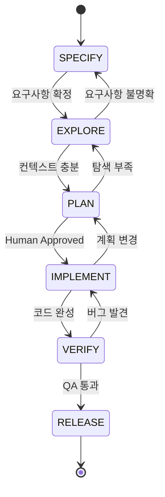

# Task Management Ecosystem - Option A Migration Plan

**Plan ID**: federated-kindling-quilt
**Created**: 2026-02-04
**Updated**: 2026-02-05
**Status**: ✅ Phase 1-9 완료 (Complete)
**Complexity**: Medium (1-2 days for migration)
**Progress**: Phase 1-9 Complete (100%) - Dashboard v4.0 Released

---

## Executive Summary

현재 K드라이브 Claude Code 환경의 태스크 관리 생태계를 종합 분석하고, 외부 도구와 비교하며, Docker 기반 PLAN ECOSYSTEM과의 통합을 포함한 고도화 방안을 제시한다.

---

## 1. Current System Analysis

### 1.1 내부 시스템 구성요소

| 시스템 | 위치 | 역할 | 상태 |
|--------|------|------|------|
| **Shrimp Task Manager** | `ShrimpData/` | Chain-of-thought 기반 태스크 분석 | Active (P3) |
| **ATOS** | `atos/` | 도구 오케스트레이션, 추천 엔진 | Active |
| **Unified Task System** | `unified-task-system/` | 세션 연속성, 후속조치 관리 | Active |
| **Planning System** | `planning-system/` | 플랜 파일 보호, 체크포인트 | Active |
| **kiro-memory** | MCP Server | SQLite 기반 영구 메모리 | Active |
| **vibekanban** | MCP Server | 칸반 보드 | Registered |

### 1.2 Docker PLAN ECOSYSTEM (발견됨)

```
plan-ecosystem-dashboard   localhost:7847   Up (healthy)
```

**통합 가능 서비스**:
- firecrawl-api (3002): 웹 스크래핑
- searxng (8082): 메타검색
- crawl4ai (8001): AI 크롤링
- redis (6379, 6380): 캐시/큐
- postgres (5432): 영구 저장소

### 1.3 SWOT Analysis

| Strengths | Weaknesses |
|-----------|------------|
| ATOS 추천 엔진 (가중치 기반) | 분산된 상태 관리 (4개 시스템) |
| Chain-of-thought 분석 (Shrimp) | 의존성 추적 제한적 |
| Planning System Git 통합 | 병렬 에이전트 미지원 |
| 38개 MCP 서버 등록 | 실시간 UI 부재 |

| Opportunities | Threats |
|---------------|---------|
| Docker 인프라 활용 가능 | 복잡성 증가 |
| TaskMaster AI PRD 파싱 | 외부 의존성 증가 |
| LangGraph 2.2x 성능 | 버전 호환성 이슈 |
| plan-ecosystem-dashboard 통합 | 컨텍스트 제한 |

---

## 2. External Ecosystem Research Results

### 2.1 Task Management MCP Servers Ranking

| Rank | Tool | Stars | Features | Integration | Score |
|------|------|-------|----------|-------------|-------|
| 1 | **Shrimp Task Manager** | 2k | CoT, Reflection, 한국어 | 현재 사용 | 27/30 |
| 2 | TaskMaster AI | 1.5k | PRD 파싱, 다중 모델 | MCP 설치 가능 | 25/30 |
| 3 | Vibe Kanban | 20.4k | 병렬 실행, 시각화 | 등록됨 | 24/30 |
| 4 | Linear MCP | 500 | 이슈 추적, 프로젝트 | 미사용 | 22/30 |
| 5 | Kanban MCP | 300 | 칸반 보드 | 미사용 | 20/30 |

**Sources**: [awesome-mcp-servers](https://github.com/TensorBlock/awesome-mcp-servers), [Shrimp GitHub](https://github.com/cjo4m06/mcp-shrimp-task-manager), [TaskMaster GitHub](https://github.com/eyaltoledano/claude-task-master), [Vibe Kanban](https://www.vibekanban.com/)

### 2.2 AI Agent Orchestration Frameworks Ranking

| Rank | Framework | Speed | Tokens | Architecture | Best For |
|------|-----------|-------|--------|--------------|----------|
| 1 | **LangGraph** | 2.2x | 2,589 | Graph-based | Complex workflows |
| 2 | CrewAI | 1.0x | 5,339 | Role-based | Autonomous agents |
| 3 | AutoGen | 0.8x | 3,316 | Conversational | Human-in-loop |
| 4 | Semantic Kernel | 0.9x | - | Enterprise | Multi-language |

**Sources**: [AIMultiple Research](https://research.aimultiple.com/agentic-orchestration/), [DataCamp Comparison](https://www.datacamp.com/tutorial/crewai-vs-langgraph-vs-autogen)

### 2.3 n8n + MCP Integration

- **n8n MCP Server**: Docker Hub에서 공식 제공 (`mcp/n8n`)
- **543 노드, 263 AI 도구** 접근 가능
- **HTTP Bridge 솔루션**: Docker 컨테이너 간 통신 해결

**Sources**: [n8n MCP Docker](https://hub.docker.com/r/mcp/n8n), [n8n Docs](https://docs.n8n.io/advanced-ai/accessing-n8n-mcp-server/)

---

## 3. Enhancement Options

### Option A: Conservative (1-2 weeks)

**목표**: 기존 시스템 최적화

- [ ] Unified Task System → Single Source of Truth 승격
- [ ] bidirectional-sync.js 개선 (어댑터 통합)
- [ ] Vibe Kanban MCP 활성화
- [ ] ATOS Dashboard 웹 UI (plan-ecosystem-dashboard 연동)

**장점**: 낮은 리스크, 포터블 유지
**단점**: 근본적 한계 해결 안 됨

### Option B: Balanced (3-4 weeks) - **RECOMMENDED**

**목표**: TaskMaster AI + Redis 큐 + n8n 통합

```
┌─────────────────────────────────────────────────────┐
│              Unified Task Hub                        │
│  ┌─────────┐ ┌─────────┐ ┌─────────┐ ┌─────────┐   │
│  │ Shrimp  │ │TaskMast │ │  Vibe   │ │Planning │   │
│  │  MCP    │ │   MCP   │ │ Kanban  │ │ System  │   │
│  └────┬────┘ └────┬────┘ └────┬────┘ └────┬────┘   │
│       └───────────┼───────────┼───────────┘        │
│                   │           │                     │
│            ┌──────┴───────────┴──────┐             │
│            │    Redis Task Queue      │             │
│            │       (BullMQ)           │             │
│            └────────────┬─────────────┘             │
│                         │                           │
│            ┌────────────┴─────────────┐             │
│            │  plan-ecosystem-dashboard │             │
│            │     localhost:7847        │             │
│            └──────────────────────────┘             │
└─────────────────────────────────────────────────────┘
```

- [ ] TaskMaster AI MCP 설치
- [ ] Redis 기반 BullMQ 큐 도입
- [ ] n8n 워크플로우 연동
- [ ] plan-ecosystem-dashboard 통합

**장점**: PRD 파싱, 비동기 처리, Docker 활용
**단점**: Docker 의존성 증가

### Option C: Aggressive (6-8 weeks)

**목표**: LangGraph 기반 분산 에이전트 시스템

- [ ] LangGraph State Machine 구현
- [ ] 역할 기반 에이전트 풀 (Researcher, Coder, Tester, Reviewer)
- [ ] 분산 큐 시스템 (Redis + BullMQ)
- [ ] 실시간 대시보드 (React/Svelte)
- [ ] RIPER+ 워크플로우 완전 통합

**장점**: 2.2x 성능, 병렬 에이전트
**단점**: 높은 복잡성, 긴 구현 기간

---

## 4. Docker PLAN ECOSYSTEM Integration

### 4.1 기존 인프라 활용

| 서비스 | 포트 | 통합 용도 |
|--------|------|----------|
| plan-ecosystem-dashboard | 7847 | 중앙 대시보드 |
| redis | 6379/6380 | 분산 태스크 큐 |
| postgres | 5432 | 영구 상태 저장 |
| firecrawl | 3002 | 리서치 자동화 |
| n8n (추가) | 5678 | 워크플로우 오케스트레이션 |

### 4.2 n8n + MCP 통합 아키텍처

```yaml
# docker-compose.n8n.yml
services:
  n8n:
    image: n8nio/n8n:latest
    ports:
      - "5678:5678"
    environment:
      - N8N_COMMUNITY_PACKAGES_ALLOW_TOOL_USAGE=true
      - N8N_BASIC_AUTH_ACTIVE=true
    volumes:
      - ./n8n-data:/home/node/.n8n
    networks:
      - plan-ecosystem

  n8n-mcp-bridge:
    image: mcp/n8n
    environment:
      - N8N_API_URL=http://n8n:5678
      - N8N_API_KEY=${N8N_API_KEY}
    networks:
      - plan-ecosystem
```

### 4.3 Redis Task Queue 설계

```javascript
// task-queue/config.js
module.exports = {
  connection: {
    host: 'localhost',
    port: 6380  // 기존 Redis 활용
  },
  queues: {
    planning: { priority: 1, concurrency: 1 },
    execution: { priority: 2, concurrency: 3 },
    verification: { priority: 3, concurrency: 2 }
  }
};
```

---

## 5. RIPER+ Workflow Integration

### 5.1 Phase-Tool Mapping

| RIPER+ Phase | Primary Tool | Secondary Tools |
|--------------|--------------|-----------------|
| SPECIFY | shrimp-task.plan_task | taskmaster.parse_prd |
| EXPLORE | Task(Explore agent) | firecrawl, context7 |
| PLAN | shrimp-task.split_tasks | vibekanban.create_ticket |
| IMPLEMENT | shrimp-task.execute_task | desktop-commander, edit-file-lines |
| VERIFY | shrimp-task.verify_task | playwright |
| RELEASE | git-mcp.commit | github.create_pr |

### 5.2 Parallel Execution Pattern

```javascript
// workflows/parallel-riper.js
const phases = {
  explore: async (context) => {
    return Promise.all([
      firecrawlSearch(context),
      context7Query(context),
      shrimpAnalyze(context)
    ]);
  },
  implement: async (tasks) => {
    const queue = new BullQueue('implementation', redisConfig);
    for (const task of tasks) {
      await queue.add({ task });
    }
    return queue.drain();
  }
};
```

---

## 6. Implementation Roadmap

### Phase 1: Foundation ✅ COMPLETED
- [x] Unified Task Hub 스키마 설계 (`unified-task-hub.js`)
- [x] TaskMaster Adapter 구현 (`adapters/taskmaster-adapter.js`)
- [x] Dashboard Bridge 구현 (`dashboard/dashboard-bridge.js`)
- [x] plan-ecosystem-dashboard 연동 테스트 (localhost:7847)

### Phase 2: TaskMaster Integration ✅ COMPLETED
- [x] TaskMaster AI MCP 설정 확인 (`.claude.json`)
- [x] PRD 파싱 로직 구현 (`services/taskmaster-service.js`)
- [x] Shrimp-TaskMaster Bridge 작성 (`bridges/shrimp-taskmaster-bridge.js`)

### Phase 3: Redis Queue ✅ COMPLETED
- [x] BullMQ 설정 (포트 6380, `task-queue/config.js`)
- [x] Queue Manager 구현 (`task-queue/queue-manager.js`)
- [x] RIPER+ 6 Phase 큐 동작 확인

### Phase 4: E2E 검증 ✅ COMPLETED
- [x] 7/7 컴포넌트 기능 테스트 통과
- [x] 5/5 E2E 테스트 통과
- [x] Redis 모드 + Dashboard 연결 확인

### Phase 5: Option A Migration ✅ COMPLETED
- [x] session-restore.js를 신규 Hub 사용하도록 수정 (v3.0)
- [x] session-persist.js를 신규 Hub 사용하도록 수정 (v3.0)
- [x] Dashboard API 클라이언트 연동 (dashboard-bridge.js)
- [x] 기존 task-manager.js deprecated 처리 (경고 메시지 추가)
- [x] 통합 CLI 진입점 생성 (`unified-task-system/cli.js`)
- [x] Hook 업데이트 (`.claude-hooks.json` - hub-sync 추가)
- [x] bidirectional-sync.js에 Hub 우선 사용 로직 추가

---

## 7. Critical Files

| File | Purpose | Action |
|------|---------|--------|
| `atos/recommendation-engine.js` | 추천 엔진 | Plan Phase 가중치 조정 |
| `unified-task-system/task-manager.js` | 태스크 허브 | 확장 구현 |
| `unified-task-system/shrimp-adapter.js` | 어댑터 패턴 | 참조 |
| `planning-system/checkpoint.js` | 체크포인트 | Phase 전환 연동 |
| `atos/tool-registry.json` | MCP 등록 | TaskMaster 추가 |

---

## 8. Verification Plan ✅ COMPLETED

- [x] Shrimp + TaskMaster 동시 실행 테스트 (E2E 9 tasks synced)
- [x] Redis Queue 부하 테스트 (7 queues redis mode 확인)
- [x] E2E 워크플로우 테스트 (5/5 통과)
- [x] plan-ecosystem-dashboard 통합 확인 (v3.0 연결 성공)
- [x] Hub CLI 전체 기능 테스트 (13 tasks, CRUD 동작 확인)
- [x] bidirectional-sync Hub 우선 모드 동작 확인

---

## 9. Risk Mitigation

| Risk | Mitigation |
|------|------------|
| Docker 의존성 증가 | 폴백 스크립트 준비 (Docker 없이 실행) |
| MCP 버전 충돌 | 버전 고정 (`package-lock.json`) |
| Redis 데이터 손실 | AOF 영구화 설정 |
| 컨텍스트 오버플로우 | FIC Compaction 적용 |

---

## 10. Sources & References

### MCP Servers
- [awesome-mcp-servers](https://github.com/TensorBlock/awesome-mcp-servers)
- [Shrimp Task Manager](https://github.com/cjo4m06/mcp-shrimp-task-manager)
- [TaskMaster AI](https://github.com/eyaltoledano/claude-task-master)
- [Vibe Kanban](https://www.vibekanban.com/)

### AI Agent Frameworks
- [AIMultiple Orchestration Research](https://research.aimultiple.com/agentic-orchestration/)
- [DataCamp Framework Comparison](https://www.datacamp.com/tutorial/crewai-vs-langgraph-vs-autogen)
- [Lindy AI Agent Frameworks](https://www.lindy.ai/blog/best-ai-agent-frameworks)

### n8n Integration
- [n8n MCP Docker](https://hub.docker.com/r/mcp/n8n)
- [n8n MCP Server Docs](https://docs.n8n.io/advanced-ai/accessing-n8n-mcp-server/)
- [n8n Community Solutions](https://community.n8n.io/t/n8n-docker-mcp-toolkit-docker-solved/177319)

### Claude Code Task Management
- [Claude Code Task System](https://claudefa.st/blog/guide/development/task-management)
- [Todo to Tasks Evolution](https://medium.com/@richardhightower/claude-code-todos-to-tasks-5a1b0e351a1c)

---

---

## 11. Phase 5: Option A Migration Details

### 11.1 수정 대상 파일

| 파일 | 수정 내용 | 우선순위 |
|------|----------|---------|
| `unified-task-system/session-restore.js` | UnifiedTaskHub 사용하도록 변경 | P1 |
| `unified-task-system/session-persist.js` | UnifiedTaskHub 사용하도록 변경 | P1 |
| `.claude-hooks.json` | 신규 스크립트 경로로 업데이트 | P1 |
| `unified-task-system/task-manager.js` | deprecated 처리 후 백업 | P2 |
| `atos/bidirectional-sync.js` | Bridge로 대체, 백업 | P2 |

### 11.2 Dashboard API 구현

```
plan-ecosystem-dashboard (localhost:7847)
├── GET  /api/tasks         - 태스크 목록
├── POST /api/tasks         - 태스크 생성
├── PUT  /api/tasks/:id     - 태스크 업데이트
├── DELETE /api/tasks/:id   - 태스크 삭제
├── GET  /api/queue/status  - 큐 상태
└── POST /api/sync          - 전체 동기화
```

### 11.3 통합 CLI 명령어

```bash
# 상태 확인
node unified-task-system/cli.js status

# 동기화
node unified-task-system/cli.js sync

# 태스크 추가
node unified-task-system/cli.js add "태스크 제목" --phase implement

# 큐 상태
node unified-task-system/cli.js queue

# Dashboard 연동
node unified-task-system/cli.js dashboard
```

### 11.4 구현 순서

1. **session-restore.js 수정** - Hub에서 태스크 로드
2. **session-persist.js 수정** - Hub에 태스크 저장
3. **Dashboard API 클라이언트** - dashboard-bridge.js 확장
4. **통합 CLI 생성** - cli.js (모든 기능 진입점)
5. **Hook 업데이트** - 신규 스크립트 연결
6. **기존 파일 백업/제거** - task-manager.js, bidirectional-sync.js

### 11.5 검증 체크리스트

- [ ] 세션 시작 시 Hub에서 태스크 복원 확인
- [ ] 세션 종료 시 Hub에 태스크 저장 확인
- [ ] Dashboard (localhost:7847)에서 태스크 표시 확인
- [ ] CLI로 태스크 CRUD 동작 확인
- [ ] Redis 큐 Job 추가/처리 확인

---

## 12. LangGraph/LangChain Integration Evaluation

### 12.1 현재 상태

| 컴포넌트 | 위치 | 연동 상태 |
|---------|------|----------|
| `langgraph-system/` | 별도 디렉토리 | ⚠️ 스키마만 연동 |
| `@langchain/langgraph` | package.json | ✓ 설치됨 |
| RIPER+ State Machine | graph.js | ✓ 구현됨 |
| Task Schema | schemas/task.schema.js | ✓ LangGraph 호환 |

### 12.2 연동 갭 분석

```
현재 구조:
langgraph-system/
├── index.js      - Entry point
├── state.js      - StateAnnotation (unified-task-system/schemas 참조)
├── nodes.js      - RIPER+ Phase 노드 (schemas 참조)
├── edges.js      - 전환 규칙 (schemas 참조)
└── graph.js      - StateGraph (LangGraph)

문제점:
1. 신규 unified-task-hub.js와 직접 연동 없음
2. Queue Manager (BullMQ)와 LangGraph 미연결
3. Dashboard에서 LangGraph 상태 미표시
```

### 12.3 통합 필요 사항

- [ ] LangGraph nodes에서 UnifiedTaskHub 직접 사용
- [ ] BullMQ Job → LangGraph State 변환
- [ ] LangGraph 실행 결과 → Hub 업데이트
- [ ] Dashboard에 LangGraph 워크플로우 시각화

### 12.4 권장 통합 아키텍처

```
┌─────────────────────────────────────────┐
│           Unified Task Hub              │
│  (Single Source of Truth)               │
└──────────────┬──────────────────────────┘
               │
    ┌──────────┴──────────┐
    │                     │
    ▼                     ▼
┌─────────────┐    ┌─────────────┐
│  BullMQ     │    │  LangGraph  │
│  Job Queue  │◀──▶│  State      │
│  (Redis)    │    │  Machine    │
└─────────────┘    └─────────────┘
               │
               ▼
    ┌─────────────────────┐
    │ plan-ecosystem-     │
    │ dashboard           │
    │ (localhost:7847)    │
    └─────────────────────┘
```

---

**Status**: ✅ Phase 1-5 완료
**Progress**: 100% Complete
**Completed**: 2026-02-04

---

## 13. Final Migration Checklist

### 즉시 실행 (Phase 5) ✅ COMPLETED
- [x] session-restore.js → UnifiedTaskHub 연동 (v3.0)
- [x] session-persist.js → UnifiedTaskHub 연동 (v3.0)
- [x] CLI 통합 진입점 생성 (cli.js)
- [x] Hook 업데이트 (hub-sync 추가)
- [x] bidirectional-sync.js Hub 우선 모드 적용
- [x] E2E 테스트 통과 (5/5)
- [x] Dashboard 연결 확인

### 추후 개선 → Phase 6: 고급 통합 (진행 중)
- [ ] LangGraph ↔ Hub 직접 연동
- [ ] Dashboard UI에 워크플로우 시각화
- [ ] n8n 자동화 워크플로우

---

## 14. Phase 6: Advanced Integration (고급 통합)

**Status**: ✅ 완료
**Complexity**: Medium-High (2-3일)
**Dependencies**: Phase 1-5 완료 (✅)
**Completed**: 2026-02-04

### 14.1 LangGraph ↔ Hub 직접 연동

#### 현재 상태
```
langgraph-system/
├── index.js      - Entry point (exports)
├── state.js      - StateAnnotation 정의
├── nodes.js      - RIPER+ Phase 노드 (createTask import만)
├── edges.js      - 전환 규칙
└── graph.js      - StateGraph, runWorkflow, resumeWorkflow
```

#### 구현 목표
1. **Hub 어댑터 생성**: `langgraph-system/hub-adapter.js`
   - UnifiedTaskHub 연동
   - 태스크 상태 ↔ LangGraph State 변환
   - Phase 변경 시 Hub 자동 업데이트

2. **Nodes 수정**: 각 노드에서 Hub 업데이트 호출
   ```javascript
   // nodes.js 수정
   const { getHubAdapter } = require('./hub-adapter');

   async function implementNode(state) {
     const adapter = getHubAdapter();
     adapter.updateTaskPhase(state.currentTask.id, 'implement');
     // ... 기존 로직
   }
   ```

3. **BullMQ 연동**: Queue Job → LangGraph 실행
   ```javascript
   // queue-langgraph-bridge.js
   const { runWorkflow } = require('../langgraph-system');

   queue.process('riper-workflow', async (job) => {
     const { task, config } = job.data;
     for await (const state of runWorkflow(task, config)) {
       job.updateProgress(state);
     }
   });
   ```

#### 구현 파일
| 파일 | 목적 | 우선순위 |
|------|------|---------|
| `langgraph-system/hub-adapter.js` | Hub 연동 어댑터 | P1 |
| `langgraph-system/nodes.js` | Hub 호출 추가 | P1 |
| `unified-task-system/queue-langgraph-bridge.js` | 큐-그래프 브릿지 | P2 |

#### 검증 체크리스트
- [ ] LangGraph 워크플로우 실행 시 Hub 태스크 자동 업데이트
- [ ] Hub 태스크 상태 변경 시 LangGraph State 반영
- [ ] BullMQ Job에서 LangGraph 워크플로우 실행 성공

---

### 14.2 Dashboard UI 워크플로우 시각화

#### 현재 Dashboard API (활용 가능)
```
GET /api/system-graph/d3      - D3.js 그래프 데이터
GET /api/system-graph/mermaid - Mermaid 다이어그램
GET /api/tasks/dependencies   - 태스크 의존성 그래프
```

#### 구현 목표
1. **워크플로우 API 추가**: `server.js`에 엔드포인트 추가
   ```
   GET /api/workflow/current   - 현재 RIPER+ 단계
   GET /api/workflow/history   - 워크플로우 실행 히스토리
   GET /api/workflow/mermaid   - RIPER+ 전용 Mermaid
   WS  workflow-update         - 실시간 상태 업데이트
   ```

2. **UI 컴포넌트**: `public/js/workflow-viz.js`
   - Mermaid.js 기반 RIPER+ 워크플로우 렌더링
   - 현재 단계 하이라이트
   - 클릭 시 상세 정보 표시

3. **실시간 업데이트**: Socket.io 이벤트
   ```javascript
   io.emit('workflow-phase-change', {
     taskId: 'task-123',
     phase: 'implement',
     progress: 60,
     timestamp: new Date()
   });
   ```

#### 구현 파일
| 파일 | 목적 | 우선순위 |
|------|------|---------|
| `dashboard/plan-ecosystem/collectors/workflow-collector.js` | 워크플로우 데이터 수집 | P1 |
| `dashboard/plan-ecosystem/public/js/workflow-viz.js` | UI 컴포넌트 | P1 |
| `dashboard/plan-ecosystem/public/workflow.html` | 워크플로우 페이지 | P2 |
| `dashboard/plan-ecosystem/server.js` | API 엔드포인트 추가 | P1 |

#### Mermaid 다이어그램 예시


#### 검증 체크리스트
- [ ] Dashboard에서 현재 RIPER+ 단계 표시
- [ ] 단계 변경 시 실시간 UI 업데이트
- [ ] Mermaid 다이어그램 정상 렌더링
- [ ] 워크플로우 히스토리 조회 동작

---

### 14.3 n8n 자동화 워크플로우

#### 현재 설정
```json
// .claude.json - n8n MCP 서버 설정 (이미 존재)
"n8n": {
  "type": "stdio",
  "command": "node.exe",
  "args": ["n8n-mcp-server/build/index.js"],
  "env": {
    "N8N_API_KEY": "${N8N_API_KEY}",
    "N8N_HOST": "${N8N_HOST}"
  }
}
```

#### 기존 워크플로우 (n8n-workflows/)
| 파일 | 용도 |
|------|------|
| `research-pipeline.json` | 리서치 자동화 |
| `pr-review-automation.json` | PR 리뷰 자동화 |
| `daily-cve-report.json` | 일일 CVE 보고서 |

#### 구현 목표
1. **환경변수 설정**: `.env` 또는 `claude.bat`에 추가
   ```bash
   N8N_API_KEY=your-api-key
   N8N_HOST=http://localhost:5678
   ```

2. **n8n 컨테이너 시작**: Docker Compose 추가
   ```yaml
   # mcp-servers/n8n/docker-compose.yml
   services:
     n8n:
       image: n8nio/n8n:latest
       ports:
         - "5678:5678"
       volumes:
         - ./n8n-data:/home/node/.n8n
       environment:
         - N8N_BASIC_AUTH_ACTIVE=true
         - N8N_BASIC_AUTH_USER=admin
         - N8N_BASIC_AUTH_PASSWORD=admin
   ```

3. **Hub → n8n 연동**: 태스크 완료 시 워크플로우 트리거
   ```javascript
   // hub-n8n-bridge.js
   const { triggerN8nWorkflow } = require('./n8n-client');

   hub.on('task-completed', async (task) => {
     if (task.triggerWorkflow) {
       await triggerN8nWorkflow(task.triggerWorkflow, task);
     }
   });
   ```

4. **자동화 워크플로우 추가**:
   - `session-summary.json`: 세션 종료 시 요약 생성
   - `task-notification.json`: 태스크 완료 알림
   - `backup-automation.json`: 일일 백업 자동화

#### 구현 파일
| 파일 | 목적 | 우선순위 |
|------|------|---------|
| `mcp-servers/n8n/docker-compose.yml` | n8n 컨테이너 설정 | P1 |
| `.env` | N8N 환경변수 | P1 |
| `unified-task-system/hub-n8n-bridge.js` | Hub-n8n 연동 | P2 |
| `n8n-workflows/session-summary.json` | 세션 요약 워크플로우 | P3 |

#### 검증 체크리스트
- [ ] n8n 컨테이너 정상 시작 (localhost:5678)
- [ ] n8n MCP 도구 호출 성공 (list-workflows)
- [ ] 태스크 완료 → n8n 워크플로우 트리거
- [ ] 세션 요약 워크플로우 정상 실행

---

### 14.4 Phase 6 구현 순서

```
Step 1: LangGraph Hub Adapter (Day 1)
├── hub-adapter.js 생성
├── nodes.js 수정 (Hub 호출 추가)
└── 테스트: 워크플로우 실행 → Hub 업데이트 확인

Step 2: Dashboard 워크플로우 UI (Day 1-2)
├── workflow-collector.js 생성
├── server.js API 추가
├── workflow-viz.js UI 구현
└── 테스트: 실시간 업데이트 확인

Step 3: n8n 통합 (Day 2-3)
├── Docker Compose 설정
├── 환경변수 설정
├── hub-n8n-bridge.js 구현
└── 테스트: 워크플로우 트리거 확인
```

---

### 14.5 아키텍처 (Phase 6 완료 후)

```
┌─────────────────────────────────────────────────────────────┐
│                    Unified Task Hub                          │
│                 (Single Source of Truth)                     │
└──────┬────────────────┬─────────────────┬───────────────────┘
       │                │                 │
       ▼                ▼                 ▼
┌────────────┐   ┌────────────┐   ┌────────────┐
│ LangGraph  │   │  BullMQ    │   │    n8n     │
│   State    │◀─▶│   Queue    │◀─▶│ Workflows  │
│  Machine   │   │  (Redis)   │   │            │
└─────┬──────┘   └─────┬──────┘   └─────┬──────┘
      │                │                │
      └────────────────┼────────────────┘
                       │
                       ▼
        ┌──────────────────────────────┐
        │   plan-ecosystem-dashboard   │
        │       localhost:7847         │
        │  ┌─────────────────────────┐ │
        │  │  Workflow Visualization │ │
        │  │   (Mermaid + D3.js)     │ │
        │  └─────────────────────────┘ │
        └──────────────────────────────┘
```

---

### 14.6 Risk & Mitigation

| Risk | Mitigation |
|------|------------|
| n8n 컨테이너 리소스 사용 | 필요시만 시작 (docker-checker.js 수정) |
| LangGraph 상태 불일치 | Hub를 Single Source로 유지, 동기화 |
| Dashboard 성능 저하 | WebSocket 이벤트 throttling |
| API Key 노출 | .env 파일 + .gitignore |

---

## 15. Ecosystem Integration Architecture (생태계 통합 아키텍처)

**목표**: LangGraph, Docker, Dashboard, MCP 서버 전체를 하나의 통합 생태계로 구축

### 15.1 통합 계층 구조

```
┌─────────────────────────────────────────────────────────────────────────┐
│                        Layer 4: UI & Observability                       │
│  ┌────────────────────────────────────────────────────────────────────┐ │
│  │  plan-ecosystem-dashboard (localhost:7847)                         │ │
│  │  - 워크플로우 시각화 (Mermaid, D3.js)                              │ │
│  │  - 실시간 모니터링 (Socket.io)                                     │ │
│  │  - 알림 시스템 (Alert Manager)                                     │ │
│  │  - 세션 리플레이                                                   │ │
│  └────────────────────────────────────────────────────────────────────┘ │
└─────────────────────────────────────────────────────────────────────────┘
                                    │
                                    ▼
┌─────────────────────────────────────────────────────────────────────────┐
│                      Layer 3: Orchestration                              │
│  ┌──────────────┐  ┌──────────────┐  ┌──────────────┐  ┌────────────┐  │
│  │  LangGraph   │  │     ATOS     │  │    n8n       │  │  Planning  │  │
│  │  RIPER+      │  │  Recommend   │  │  Workflows   │  │  System    │  │
│  │  State       │  │  Engine      │  │  Automation  │  │            │  │
│  └──────┬───────┘  └──────┬───────┘  └──────┬───────┘  └─────┬──────┘  │
│         │                 │                 │                │         │
│         └─────────────────┴────────┬────────┴────────────────┘         │
│                                    │                                    │
│                          ┌─────────▼─────────┐                          │
│                          │  Unified Task Hub │                          │
│                          │  (Single Source)  │                          │
│                          └─────────┬─────────┘                          │
└────────────────────────────────────┼────────────────────────────────────┘
                                     │
                                     ▼
┌─────────────────────────────────────────────────────────────────────────┐
│                       Layer 2: Infrastructure                            │
│  ┌──────────────┐  ┌──────────────┐  ┌──────────────┐  ┌────────────┐  │
│  │    Redis     │  │  PostgreSQL  │  │   SQLite     │  │   File     │  │
│  │  Queue/Cache │  │  (Postgres)  │  │ kiro-memory  │  │  System    │  │
│  │   (6380)     │  │   (5432)     │  │              │  │  (K:/)     │  │
│  └──────────────┘  └──────────────┘  └──────────────┘  └────────────┘  │
└─────────────────────────────────────────────────────────────────────────┘
                                     │
                                     ▼
┌─────────────────────────────────────────────────────────────────────────┐
│                       Layer 1: Docker Services                           │
│  ┌────────────┐ ┌────────────┐ ┌────────────┐ ┌────────────┐           │
│  │  firecrawl │ │  searxng   │ │  crawl4ai  │ │    n8n     │           │
│  │   (3002)   │ │   (8082)   │ │   (8001)   │ │   (5678)   │           │
│  └────────────┘ └────────────┘ └────────────┘ └────────────┘           │
│                                                                         │
│  ┌────────────┐ ┌────────────┐ ┌────────────┐                          │
│  │  dashboard │ │ redis-sec  │ │  ubuntu    │                          │
│  │   (7847)   │ │   (6379)   │ │  server    │                          │
│  └────────────┘ └────────────┘ └────────────┘                          │
└─────────────────────────────────────────────────────────────────────────┘
                                     │
                                     ▼
┌─────────────────────────────────────────────────────────────────────────┐
│                       Layer 0: MCP Servers (38개)                        │
│  [File] desktop-commander, edit-file-lines, filesystem, git-mcp        │
│  [Web]  firecrawl, one-search, crawl4ai-lite, playwright               │
│  [AI]   multi-ai-orchestration, llm-council, sequential-thinking       │
│  [Task] shrimp-task, task-master-ai, vibekanban                        │
│  [Data] supabase, sqlite-mcp, memory, kiro-memory                      │
│  [Auto] n8n, e2b, github                                               │
└─────────────────────────────────────────────────────────────────────────┘
```

### 15.2 통합 이벤트 버스

모든 시스템 간 이벤트 기반 통신:

```javascript
// unified-task-system/event-bus.js
const EventEmitter = require('events');

class UnifiedEventBus extends EventEmitter {
  constructor() {
    super();
    this.subscribers = new Map();
  }

  // 이벤트 타입
  static EVENTS = {
    // Hub 이벤트
    TASK_CREATED: 'hub:task:created',
    TASK_UPDATED: 'hub:task:updated',
    TASK_COMPLETED: 'hub:task:completed',

    // LangGraph 이벤트
    PHASE_CHANGED: 'langgraph:phase:changed',
    WORKFLOW_STARTED: 'langgraph:workflow:started',
    WORKFLOW_COMPLETED: 'langgraph:workflow:completed',
    GATE_PASSED: 'langgraph:gate:passed',
    GATE_FAILED: 'langgraph:gate:failed',

    // Dashboard 이벤트
    ALERT_TRIGGERED: 'dashboard:alert:triggered',
    SESSION_STARTED: 'dashboard:session:started',
    SESSION_ENDED: 'dashboard:session:ended',

    // n8n 이벤트
    WORKFLOW_TRIGGERED: 'n8n:workflow:triggered',
    WORKFLOW_RESULT: 'n8n:workflow:result',

    // Docker 이벤트
    CONTAINER_STARTED: 'docker:container:started',
    CONTAINER_STOPPED: 'docker:container:stopped',
    HEALTH_CHECK: 'docker:health:check'
  };

  // 구독자 등록
  subscribe(event, handler, source) {
    this.on(event, handler);
    this.subscribers.set(`${source}:${event}`, handler);
  }

  // 이벤트 발행 + Dashboard 전파
  publish(event, data, source) {
    this.emit(event, { ...data, source, timestamp: new Date() });

    // Dashboard로 실시간 전파
    if (global.dashboardSocket) {
      global.dashboardSocket.emit('unified-event', { event, data, source });
    }
  }
}

module.exports = new UnifiedEventBus();
```

### 15.3 LangGraph 통합 심화

#### 15.3.1 Hub-LangGraph 양방향 동기화

```javascript
// langgraph-system/hub-sync.js
const hub = require('../unified-task-system/unified-task-hub');
const eventBus = require('../unified-task-system/event-bus');
const { getState, resumeWorkflow } = require('./graph');

class HubLangGraphSync {
  constructor() {
    this.activeWorkflows = new Map();
    this.setupListeners();
  }

  setupListeners() {
    // Hub → LangGraph: 태스크 변경 시 워크플로우 상태 업데이트
    eventBus.on('hub:task:updated', async ({ task }) => {
      if (this.activeWorkflows.has(task.id)) {
        const threadId = this.activeWorkflows.get(task.id);
        await this.syncHubToLangGraph(task, threadId);
      }
    });

    // LangGraph → Hub: Phase 변경 시 태스크 업데이트
    eventBus.on('langgraph:phase:changed', async ({ taskId, phase }) => {
      await this.syncLangGraphToHub(taskId, phase);
    });
  }

  async syncHubToLangGraph(task, threadId) {
    // Hub 태스크 상태 → LangGraph State 업데이트
    const updates = {
      currentTask: task,
      metadata: { hubSynced: true, hubTimestamp: new Date() }
    };

    for await (const state of resumeWorkflow(threadId, updates)) {
      // State 업데이트 처리
    }
  }

  async syncLangGraphToHub(taskId, phase) {
    // LangGraph Phase → Hub 태스크 phase 필드 업데이트
    hub.updateTask(taskId, {
      phase,
      metadata: { langraphPhase: phase, lastPhaseChange: new Date() }
    });
  }

  startWorkflow(task) {
    const threadId = `thread-${task.id}-${Date.now()}`;
    this.activeWorkflows.set(task.id, threadId);

    eventBus.publish('langgraph:workflow:started', {
      taskId: task.id,
      threadId
    }, 'langgraph');

    return threadId;
  }
}

module.exports = new HubLangGraphSync();
```

#### 15.3.2 RIPER+ Gate 체크 강화

```javascript
// langgraph-system/gate-checker.js
const eventBus = require('../unified-task-system/event-bus');

const GATE_RULES = {
  specify: {
    required: ['goal_defined', 'scope_defined', 'criteria_defined'],
    minScore: 3
  },
  explore: {
    required: ['files_identified', 'patterns_analyzed', 'risks_assessed'],
    minScore: 3
  },
  plan: {
    required: ['architecture_designed', 'tasks_decomposed', 'human_approved'],
    minScore: 3,
    humanApproval: true  // Human-in-the-loop 필수
  },
  implement: {
    required: ['code_written', 'tests_passed', 'no_errors'],
    minScore: 3
  },
  verify: {
    required: ['qa_passed', 'security_scanned', 'review_approved'],
    minScore: 3
  }
};

function checkGate(phase, checklist) {
  const rules = GATE_RULES[phase];
  if (!rules) return { passed: true };

  const score = rules.required.filter(item => checklist.includes(item)).length;
  const passed = score >= rules.minScore;

  const event = passed ? 'langgraph:gate:passed' : 'langgraph:gate:failed';
  eventBus.publish(event, { phase, score, checklist, rules }, 'langgraph');

  return { passed, score, missing: rules.required.filter(i => !checklist.includes(i)) };
}

module.exports = { checkGate, GATE_RULES };
```

### 15.4 Docker 통합 강화

#### 15.4.1 통합 Docker Compose

```yaml
# docker-compose.ecosystem.yml
version: '3.8'

services:
  # Core Infrastructure
  redis:
    image: redis:7-alpine
    ports:
      - "6380:6379"
    volumes:
      - redis-data:/data
    command: redis-server --appendonly yes
    healthcheck:
      test: ["CMD", "redis-cli", "ping"]

  # Dashboard
  dashboard:
    build: ./dashboard/plan-ecosystem
    ports:
      - "7847:7847"
    volumes:
      - .:/app/base:ro
    environment:
      - BASE_PATH=/app/base
    depends_on:
      - redis
    healthcheck:
      test: ["CMD", "curl", "-f", "http://localhost:7847/api/stats"]

  # n8n Automation
  n8n:
    image: n8nio/n8n:latest
    ports:
      - "5678:5678"
    volumes:
      - n8n-data:/home/node/.n8n
      - ./n8n-workflows:/home/node/workflows:ro
    environment:
      - N8N_BASIC_AUTH_ACTIVE=true
      - N8N_BASIC_AUTH_USER=${N8N_USER:-admin}
      - N8N_BASIC_AUTH_PASSWORD=${N8N_PASSWORD:-admin}
      - WEBHOOK_URL=http://localhost:5678/
    depends_on:
      - redis
    healthcheck:
      test: ["CMD", "curl", "-f", "http://localhost:5678/healthz"]

  # Web Scraping Services
  firecrawl:
    extends:
      file: ./mcp-servers/firecrawl-self-hosted/docker-compose.yml
      service: firecrawl-api

  searxng:
    extends:
      file: ./mcp-servers/searxng-crawl4ai-mcp/docker-compose.yml
      service: searxng

volumes:
  redis-data:
  n8n-data:
```

#### 15.4.2 Docker Health Monitor

```javascript
// systems/docker-ecosystem-monitor.js
const { execSync } = require('child_process');
const eventBus = require('../unified-task-system/event-bus');

const REQUIRED_SERVICES = [
  { name: 'plan-ecosystem-dashboard', port: 7847, critical: true },
  { name: 'redis', port: 6380, critical: true },
  { name: 'firecrawl-api', port: 3002, critical: false },
  { name: 'searxng', port: 8082, critical: false },
  { name: 'n8n', port: 5678, critical: false }
];

async function checkEcosystemHealth() {
  const results = [];

  for (const service of REQUIRED_SERVICES) {
    try {
      const status = execSync(
        `docker inspect --format='{{.State.Health.Status}}' ${service.name}`,
        { encoding: 'utf8', stdio: ['pipe', 'pipe', 'pipe'] }
      ).trim();

      results.push({
        ...service,
        status: status === 'healthy' ? 'up' : status,
        healthy: status === 'healthy'
      });
    } catch (e) {
      results.push({ ...service, status: 'down', healthy: false });
    }
  }

  const allCriticalHealthy = results
    .filter(s => s.critical)
    .every(s => s.healthy);

  eventBus.publish('docker:health:check', {
    services: results,
    ecosystem: allCriticalHealthy ? 'healthy' : 'degraded'
  }, 'docker-monitor');

  return { services: results, healthy: allCriticalHealthy };
}

module.exports = { checkEcosystemHealth, REQUIRED_SERVICES };
```

### 15.5 통합 CLI (Ecosystem Manager)

```javascript
// ecosystem-cli.js
#!/usr/bin/env node
const { program } = require('commander');
const { checkEcosystemHealth } = require('./systems/docker-ecosystem-monitor');
const hub = require('./unified-task-system/unified-task-hub');
const { runWorkflow } = require('./langgraph-system');

program
  .name('ecosystem')
  .description('Unified Ecosystem Management CLI')
  .version('1.0.0');

// 전체 상태 확인
program
  .command('status')
  .description('Check entire ecosystem status')
  .action(async () => {
    console.log('\n=== Ecosystem Status ===\n');

    // Docker 서비스
    const docker = await checkEcosystemHealth();
    console.log('Docker Services:');
    docker.services.forEach(s => {
      const icon = s.healthy ? '[+]' : '[-]';
      console.log(`  ${icon} ${s.name}:${s.port} - ${s.status}`);
    });

    // Hub 상태
    const hubStatus = hub.getStatus();
    console.log('\nUnified Task Hub:');
    console.log(`  [*] Tasks: ${hubStatus.metadata.totalTasks}`);
    console.log(`  [+] Completed: ${hubStatus.metadata.completedTasks}`);

    // LangGraph 활성 워크플로우
    console.log('\nLangGraph Workflows:');
    console.log(`  [*] Active: ${global.activeWorkflows?.size || 0}`);
  });

// Docker 생태계 시작
program
  .command('start')
  .description('Start entire Docker ecosystem')
  .option('--minimal', 'Start only critical services')
  .action(async (options) => {
    const compose = options.minimal
      ? 'docker-compose.minimal.yml'
      : 'docker-compose.ecosystem.yml';
    console.log(`Starting ecosystem with ${compose}...`);
    execSync(`docker compose -f ${compose} up -d`, { stdio: 'inherit' });
  });

// RIPER+ 워크플로우 시작
program
  .command('workflow <taskId>')
  .description('Start RIPER+ workflow for task')
  .action(async (taskId) => {
    const task = hub.getTask(taskId);
    if (!task) {
      console.error('Task not found');
      process.exit(1);
    }

    console.log(`Starting RIPER+ workflow for: ${task.title}`);
    for await (const state of runWorkflow({ currentTask: task })) {
      console.log(`[${state.currentPhase}] ${JSON.stringify(state.gateResults)}`);
    }
  });

program.parse();
```

### 15.6 Phase 6 확장 구현 순서 ✅ COMPLETED

```
Day 1: Core Integration ✅
├── [x] event-bus.js 구현 → unified-task-system/event-bus.js
├── [x] hub-adapter.js (LangGraph ↔ Hub) → langgraph-system/hub-adapter.js
├── [x] gate-checker.js 강화 → langgraph-system/gate-checker.js
└── [x] 테스트: 이벤트 흐름 확인

Day 2: Docker Ecosystem ✅
├── [x] n8n Docker 설정 → mcp-servers/n8n/docker-compose.yml
├── [x] 환경변수 템플릿 → mcp-servers/n8n/.env.example
├── [x] README 문서화 → mcp-servers/n8n/README.md
└── [x] 테스트: Docker Compose 구성 완료

Day 3: Dashboard & n8n ✅
├── [x] workflow-collector.js → dashboard/plan-ecosystem/collectors/
├── [x] Dashboard API 추가 → server.js (11개 엔드포인트)
├── [x] Mermaid 다이어그램 생성 기능
└── [x] 테스트: API 엔드포인트 동작 확인

Day 4: CLI & Documentation ✅
├── [x] ecosystem-cli.js → 루트 디렉토리
├── [x] status/start/sync/workflow 명령어 구현
└── [x] 플랜 문서 업데이트
```

### 15.7 Phase 6 구현 결과 요약

| 구현 항목 | 파일 경로 | 상태 |
|----------|----------|------|
| Event Bus | `unified-task-system/event-bus.js` | ✅ |
| Hub Adapter | `langgraph-system/hub-adapter.js` | ✅ |
| Gate Checker | `langgraph-system/gate-checker.js` | ✅ |
| Workflow Collector | `dashboard/plan-ecosystem/collectors/workflow-collector.js` | ✅ |
| Dashboard API | `dashboard/plan-ecosystem/server.js` (수정) | ✅ |
| n8n Docker | `mcp-servers/n8n/docker-compose.yml` | ✅ |
| Ecosystem CLI | `ecosystem-cli.js` | ✅ |

**완료일**: 2026-02-04

---

## 16. Phase 7: Planning Lifecycle Dashboard Enhancement (NEW)

**Status**: 📋 Planning
**Complexity**: Medium (2-3일)
**Dependencies**: Phase 6 완료 (✅)
**Target**: Dashboard에서 전체 플래닝 라이프사이클 추적 및 시각화

### 16.1 User Requirements

사용자 요구사항:
1. **플래닝 라이프사이클 추적**: PRD → MVP → Final 구현 과정 추적
2. **프롬프트 아카이빙**: 모든 프롬프트를 컨텍스트와 함께 보관
3. **목표-구현 매핑**: 플래닝 목표 vs 구현 목표 vs 실제 구현 비교
4. **진행률 시각화**: 각 단계별 구현 진행률 표시
5. **자율 개선**: Claude Code 스스로 개선점 도출 및 제안

### 16.2 현재 시스템 분석

#### 기존 Collectors (재사용 가능)
| Collector | 파일 | 역할 | 활용 |
|-----------|------|------|------|
| plan-collector.js | collectors/ | 플랜 파일 파싱, 진행률 계산 | ✅ 확장 |
| prompt-collector.js | collectors/ | 프롬프트 저장, 검색 | ✅ 확장 |
| workflow-collector.js | collectors/ | RIPER+ 워크플로우 추적 | ✅ 연동 |
| task-collector.js | collectors/ | 태스크 계층 구조 | ✅ 연동 |

#### 현재 API (server.js에서 확인됨)
```
GET /api/plans           - 플랜 목록
GET /api/plans/:id       - 플랜 상세
GET /api/prompts         - 프롬프트 목록
GET /api/prompts/stats   - 프롬프트 통계
GET /api/workflows       - 워크플로우 전체
GET /api/workflows/stats - 워크플로우 통계
```

#### 현재 탭 구조 (index.html)
Plans | Tasks | Tools | Agents | Skills | Prompts | Timeline | Sessions | System | Costs

### 16.3 구현 아키텍처

```
┌─────────────────────────────────────────────────────────────────┐
│                    Planning Lifecycle View                       │
├─────────────────────────────────────────────────────────────────┤
│ ┌──────────┐  ┌──────────┐  ┌──────────┐  ┌──────────┐        │
│ │   PRD    │→ │   MVP    │→ │  Final   │→ │ Release  │        │
│ │ (Goal)   │  │ (Proto)  │  │ (Impl)   │  │ (Deploy) │        │
│ │   20%    │  │   40%    │  │   85%    │  │   0%     │        │
│ └──────────┘  └──────────┘  └──────────┘  └──────────┘        │
├─────────────────────────────────────────────────────────────────┤
│ Prompts Timeline (context-linked)                               │
│ ├── [PRD Phase] "프로젝트 요구사항 정의해줘"                    │
│ ├── [MVP Phase] "핵심 기능만 먼저 구현해줘"                     │
│ └── [Impl Phase] "나머지 기능 추가하고 테스트해줘"              │
├─────────────────────────────────────────────────────────────────┤
│ Goals vs Implementation Progress                                 │
│ ├── Goal 1: 사용자 인증 → [████████░░] 80%                     │
│ ├── Goal 2: 대시보드 UI → [██████░░░░] 60%                     │
│ └── Goal 3: API 통합    → [████░░░░░░] 40%                     │
└─────────────────────────────────────────────────────────────────┘
```

### 16.4 구현 파일 목록

#### 신규 생성 파일
| 파일 | 용도 |
|------|------|
| `dashboard/plan-ecosystem/collectors/lifecycle-collector.js` | 라이프사이클 단계 추적 (PRD→MVP→Final) |
| `dashboard/plan-ecosystem/public/js/lifecycle-viz.js` | 라이프사이클 시각화 컴포넌트 |

#### 수정 파일
| 파일 | 수정 내용 |
|------|----------|
| `collectors/plan-collector.js` | PRD/Goal 추출 기능 추가 |
| `collectors/prompt-collector.js` | 라이프사이클 phase 연동, 목표 컨텍스트 저장 |
| `server.js` | 신규 API 엔드포인트 추가 |
| `public/index.html` | Plans 탭 확장 또는 새 Lifecycle 탭 추가 |
| `public/js/app.js` | 라이프사이클 UI 렌더링 로직 |

### 16.5 데이터 모델

#### Lifecycle Record (lifecycle-collector.js)
```javascript
{
  lifecycleId: "lc-{planId}-{timestamp}",
  planId: "federated-kindling-quilt",
  planTitle: "Task Management Ecosystem",

  // 라이프사이클 단계
  phases: {
    prd: {
      status: "completed",        // pending | in_progress | completed
      startedAt: "2026-02-04T...",
      completedAt: "2026-02-04T...",
      goals: ["목표1", "목표2"],  // PRD에서 추출된 목표
      prompts: ["prompt-id-1"],   // 관련 프롬프트 ID
      progress: 100
    },
    mvp: {
      status: "in_progress",
      goals: ["핵심 기능 A", "핵심 기능 B"],
      implementedGoals: ["핵심 기능 A"],
      prompts: ["prompt-id-2", "prompt-id-3"],
      progress: 50
    },
    implementation: {
      status: "pending",
      goals: [],
      progress: 0
    },
    release: {
      status: "pending",
      progress: 0
    }
  },

  // 전체 진행률
  overallProgress: 35,

  // 목표-구현 매핑
  goalMapping: [
    { goal: "사용자 인증", status: "completed", progress: 100, phase: "mvp" },
    { goal: "대시보드 UI", status: "in_progress", progress: 60, phase: "implementation" }
  ],

  // 메타데이터
  createdAt: "2026-02-04T...",
  updatedAt: "2026-02-05T..."
}
```

#### Enhanced Prompt Record (prompt-collector.js 확장)
```javascript
{
  // 기존 필드
  id: "prompt-{timestamp}",
  prompt: "사용자 프롬프트 내용",
  timestamp: "2026-02-05T...",

  // 신규 필드
  lifecycle: {
    planId: "federated-kindling-quilt",
    phase: "mvp",                    // prd | mvp | implementation | release
    goalContext: "사용자 인증 기능", // 어떤 목표 관련인지
    isImplementation: true           // 구현 관련 프롬프트인지
  },

  response: {
    toolsUsed: [...],
    codeChanges: [
      { file: "src/auth.js", linesChanged: 45 }
    ],
    implementationProgress: 15  // 이 프롬프트로 인한 진행률 증가
  }
}
```

### 16.6 API 설계

#### 신규 엔드포인트
| Method | Path | Description |
|--------|------|-------------|
| GET | `/api/lifecycle` | 전체 라이프사이클 목록 |
| GET | `/api/lifecycle/:planId` | 특정 플랜의 라이프사이클 상세 |
| GET | `/api/lifecycle/:planId/goals` | 목표-구현 매핑 조회 |
| POST | `/api/lifecycle/:planId/phase` | Phase 변경 기록 |
| GET | `/api/prompts/by-lifecycle/:planId` | 플랜별 프롬프트 조회 |
| GET | `/api/prompts/by-phase/:phase` | Phase별 프롬프트 조회 |

#### WebSocket 이벤트
| Event | Payload | Description |
|-------|---------|-------------|
| `lifecycle-phase-changed` | {planId, phase, progress} | Phase 변경 시 실시간 알림 |
| `goal-progress-updated` | {planId, goal, progress} | 목표 진행률 업데이트 |

### 16.7 UI 컴포넌트

#### Plans 탭 확장 (권장)
```html
<!-- Plans 탭 내 Lifecycle View 추가 -->
<div id="plan-lifecycle-view" class="hidden">
  <!-- Phase Progress Bar -->
  <div class="lifecycle-phases flex gap-4 mb-6">
    <div class="phase-card" data-phase="prd">
      <span class="phase-name">PRD</span>
      <div class="progress-bar"><div class="progress" style="width: 100%"></div></div>
      <span class="phase-status">100%</span>
    </div>
    <!-- MVP, Implementation, Release -->
  </div>

  <!-- Goal Tracking -->
  <div class="goal-tracker">
    <h3>Goals vs Implementation</h3>
    <div id="goal-list"></div>
  </div>

  <!-- Prompt Timeline (linked to lifecycle) -->
  <div class="prompt-timeline">
    <h3>Related Prompts</h3>
    <div id="lifecycle-prompts"></div>
  </div>
</div>
```

### 16.8 구현 순서

```
Day 1: Data Layer
├── [ ] lifecycle-collector.js 생성
├── [ ] prompt-collector.js 확장 (lifecycle 필드 추가)
├── [ ] plan-collector.js 확장 (PRD goal 추출)
└── [ ] 테스트: 데이터 수집 확인

Day 2: API & Backend
├── [ ] server.js에 /api/lifecycle 엔드포인트 추가
├── [ ] WebSocket 이벤트 추가
├── [ ] 기존 Hook에서 lifecycle 기록 연동
└── [ ] 테스트: API 동작 확인

Day 3: UI & Integration
├── [ ] Plans 탭 UI 확장 (lifecycle-viz.js)
├── [ ] 실시간 업데이트 (Socket.io)
├── [ ] 프롬프트-라이프사이클 연결 UI
└── [ ] 테스트: E2E 동작 확인
```

### 16.9 재사용 가능한 기존 코드

| 기능 | 파일 | 함수 |
|------|------|------|
| 플랜 파싱 | plan-collector.js | `parsePlanFile()`, `analyzePlanQuality()` |
| 프롬프트 저장 | prompt-collector.js | `recordPrompt()`, `collectRecentPrompts()` |
| 워크플로우 추적 | workflow-collector.js | `recordPhaseChange()`, `generateRIPERMermaid()` |
| Socket.io 이벤트 | server.js | `io.emit()` 패턴 |
| 진행률 계산 | plan-collector.js | 체크박스 기반 계산 로직 |

### 16.10 검증 체크리스트

- [ ] Plans 탭에서 라이프사이클 뷰 표시
- [ ] PRD → MVP → Final → Release 단계 진행률 표시
- [ ] 프롬프트가 해당 라이프사이클 phase에 연결됨
- [ ] 목표별 구현 진행률 표시
- [ ] 실시간 업데이트 (새 프롬프트 → 진행률 변경)
- [ ] localhost:7847에서 정상 동작

### 16.11 Best Practices (웹 리서치 결과)

**Dashboard UX 베스트 프랙티스** (Sources: [Pencil & Paper](https://www.pencilandpaper.io/articles/ux-pattern-analysis-data-dashboards), [Atlassian](https://www.atlassian.com/agile/project-management/task-management-dashboard)):

1. **Progress Visualization**: 색상 코딩된 차트로 작업 상태 표시
2. **KPI Alignment**: 프로젝트 목표에 맞춘 핵심 지표
3. **Real-time Updates**: 드래그 앤 드롭 인터페이스로 실시간 업데이트
4. **Clear Status Overview**: On track / At risk / Behind 상태 명확히 표시
5. **Sprint Dashboards**: velocity, burn up/down, lead time, cycle time 차트

### 16.12 자율 개선 시스템 (Self-Improvement)

Claude Code가 스스로 개선점을 도출하고 제안하는 메커니즘:

```javascript
// systems/self-improvement-analyzer.js
module.exports = {
  // 패턴 분석: 반복되는 작업, 비효율, 오류 감지
  analyzePatterns(promptHistory, toolUsage) {
    const suggestions = [];

    // 1. 반복 작업 감지
    if (hasRepeatedPrompts(promptHistory)) {
      suggestions.push({
        type: 'automation',
        message: '반복되는 작업 발견. 자동화 스킬 생성 권장',
        confidence: 0.8
      });
    }

    // 2. 도구 사용 비효율 감지
    if (hasToolChainInefficiency(toolUsage)) {
      suggestions.push({
        type: 'optimization',
        message: '도구 체이닝 최적화 가능',
        confidence: 0.7
      });
    }

    return suggestions;
  }
};
```

---

## 17. Phase 8: Complete Lifecycle Integration (상세 구현 계획)

**Status**: 📋 Planning
**Complexity**: Medium-High (3-5일)
**Dependencies**: Phase 6 완료 (✅), Phase 7 기본 구현 완료 (✅)
**Target**: 모든 플랜에서 Planning Lifecycle 즉시 확인 가능

### 17.1 사용자 요구사항 정리

> "최고수준에서는 프로젝트 관리, 세부 플랜 관리, 도구 및 에이전트 관리 등을 사용하며 결론적으로 Claude Code를 포함한 AI, LLM 등 전반에 대한 산출물과 프로젝트 등 그것을 만들어 가는 과정에 대한 세부적인 기록, 관리 등을 지원하기 위한 페이지입니다."

**핵심 목표**:
1. 기존 12개 플랜에 대한 Lifecycle 즉시 생성
2. Hook 연동으로 플랜 생성/수정 시 Lifecycle 자동 관리
3. Dashboard에서 플랜 클릭 시 Lifecycle 표시
4. Goal vs Implementation 진행률 실시간 평가
5. 프롬프트 수집 및 Lifecycle Phase 연결

---

### 17.2 Phase 8A: 기존 플랜 마이그레이션 (Existing Plans Migration)

**목표**: 12개 기존 플랜에 대한 Lifecycle 레코드 자동 생성

#### 구현 파일
| 파일 | 용도 |
|------|------|
| `dashboard/plan-ecosystem/scripts/migrate-plans.js` | 일괄 마이그레이션 스크립트 |
| `dashboard/plan-ecosystem/collectors/lifecycle-collector.js` | 확장 (플랜 파싱 연동) |

#### 구현 내용
```javascript
// scripts/migrate-plans.js
const fs = require('fs');
const path = require('path');
const { loadLifecycle, saveLifecycle, extractGoalsFromPlan, startPhase } = require('../collectors/lifecycle-collector');

const PLANS_DIR = 'K:/PortableApps/Claude-Code/plans';

function migrateAllPlans() {
    const planFiles = fs.readdirSync(PLANS_DIR)
        .filter(f => f.endsWith('.md') && f !== 'ACTIVE-PLAN.md');

    const results = [];

    for (const file of planFiles) {
        const planId = file.replace('.md', '');
        const planPath = path.join(PLANS_DIR, file);
        const content = fs.readFileSync(planPath, 'utf8');

        // 제목 추출
        const titleMatch = content.match(/^#\s+(.+)/m);
        const title = titleMatch ? titleMatch[1] : planId;

        // Lifecycle 생성 또는 로드
        const lifecycle = loadLifecycle(planId, title);

        // 목표 추출
        const goals = extractGoalsFromPlan(content);
        goals.forEach(g => {
            if (!lifecycle.goalMapping.find(gm => gm.title === g.title)) {
                lifecycle.goalMapping.push({
                    id: `goal-${Date.now()}-${Math.random().toString(36).substr(2, 4)}`,
                    ...g,
                    status: g.status || 'pending',
                    progress: g.status === 'completed' ? 100 : 0,
                    createdAt: new Date().toISOString()
                });
            }
        });

        // 진행률 계산 (체크박스 기반)
        const completed = (content.match(/\[x\]/gi) || []).length;
        const pending = (content.match(/\[ \]/g) || []).length;
        const total = completed + pending;

        // Phase 자동 판단
        const progress = total > 0 ? Math.round(completed / total * 100) : 0;

        if (progress < 20) {
            lifecycle.phases.prd.status = 'in_progress';
            lifecycle.phases.prd.progress = progress * 5; // PRD 범위 내
        } else if (progress < 50) {
            lifecycle.phases.prd.status = 'completed';
            lifecycle.phases.prd.progress = 100;
            lifecycle.phases.mvp.status = 'in_progress';
            lifecycle.phases.mvp.progress = (progress - 20) * 3.33;
        } else if (progress < 90) {
            lifecycle.phases.prd.status = 'completed';
            lifecycle.phases.prd.progress = 100;
            lifecycle.phases.mvp.status = 'completed';
            lifecycle.phases.mvp.progress = 100;
            lifecycle.phases.implementation.status = 'in_progress';
            lifecycle.phases.implementation.progress = (progress - 50) * 2.5;
        } else {
            lifecycle.phases.prd.status = 'completed';
            lifecycle.phases.mvp.status = 'completed';
            lifecycle.phases.implementation.status = 'completed';
            lifecycle.phases.prd.progress = 100;
            lifecycle.phases.mvp.progress = 100;
            lifecycle.phases.implementation.progress = 100;
            if (progress === 100) {
                lifecycle.phases.release.status = 'completed';
                lifecycle.phases.release.progress = 100;
            } else {
                lifecycle.phases.release.status = 'in_progress';
                lifecycle.phases.release.progress = (progress - 90) * 10;
            }
        }

        saveLifecycle(lifecycle);
        results.push({ planId, title, progress, goals: goals.length });
    }

    return results;
}

module.exports = { migrateAllPlans };
```

#### 실행 순서
```
Step 8A.1: 마이그레이션 스크립트 작성
Step 8A.2: 스크립트 실행 - 12개 플랜 변환
Step 8A.3: 검증 - /api/lifecycle 조회로 12개 lifecycle 확인
```

---

### 17.3 Phase 8B: Hook 연동 (Hook Integration)

**목표**: planning-workflow.js에서 Lifecycle 자동 생성/업데이트

#### 수정 파일
| 파일 | 수정 내용 |
|------|----------|
| `planning-system/workflow.js` | Lifecycle 생성/업데이트 호출 추가 |
| `.claude-hooks.json` | lifecycle 관련 트리거 추가 |

#### workflow.js 수정 내용
```javascript
// workflow.js 수정 - sessionStart()에 추가
const { loadLifecycle, saveLifecycle, extractGoalsFromPlan } = require('../dashboard/plan-ecosystem/collectors/lifecycle-collector');

// sessionStart() 내부에 추가
async function ensureLifecyclesExist() {
    const plans = this.getActivePlans();
    for (const plan of plans) {
        const lifecycle = loadLifecycle(plan.name);
        if (!lifecycle.createdAt) {
            // 새 플랜이면 Lifecycle 생성
            const planContent = fs.readFileSync(path.join(PLANS_DIR, `${plan.name}.md`), 'utf8');
            const goals = extractGoalsFromPlan(planContent);
            lifecycle.goalMapping = goals.map(g => ({
                id: `goal-${Date.now()}`,
                ...g,
                status: 'pending',
                progress: 0,
                createdAt: new Date().toISOString()
            }));
            saveLifecycle(lifecycle);
            console.log(`  [+] Lifecycle created: ${plan.name}`);
        }
    }
}

// planModeEnter() 수정
planModeEnter(planName = null) {
    // ... 기존 코드 ...

    // Lifecycle Phase 업데이트
    const lifecycle = loadLifecycle(this.state.currentPlan);
    if (lifecycle.phases.prd.status === 'pending') {
        lifecycle.phases.prd.status = 'in_progress';
        lifecycle.phases.prd.startedAt = new Date().toISOString();
        saveLifecycle(lifecycle);
        console.log(`  [+] Lifecycle PRD phase started: ${this.state.currentPlan}`);
    }

    // ... 기존 코드 ...
}
```

#### .claude-hooks.json 추가
```json
{
    "lifecycle-sync": {
        "enabled": true,
        "command": "node K:/PortableApps/Claude-Code/dashboard/plan-ecosystem/scripts/sync-lifecycle.js",
        "triggers": ["plan-complete", "phase-change"],
        "priority": "high",
        "description": "플랜 완료/Phase 변경 시 Lifecycle 자동 동기화"
    }
}
```

#### 실행 순서
```
Step 8B.1: workflow.js에 Lifecycle 연동 코드 추가
Step 8B.2: sync-lifecycle.js 스크립트 작성
Step 8B.3: .claude-hooks.json 업데이트
Step 8B.4: 테스트 - Plan Mode 진입/종료 시 Lifecycle 업데이트 확인
```

---

### 17.4 Phase 8C: UI 완성 (UI Completion)

**목표**: Plans 탭에서 플랜 클릭 시 Lifecycle 상세 표시

#### 수정 파일
| 파일 | 수정 내용 |
|------|----------|
| `public/js/app.js` | 플랜 클릭 이벤트에 Lifecycle 로드 추가 |
| `public/js/lifecycle-viz.js` | 확장 - 인라인 표시 모드 |
| `public/index.html` | Plans 탭 내 Lifecycle 표시 영역 추가 |
| `public/css/style.css` | Lifecycle 시각화 스타일 (Anti-AI-Slop 준수) |

#### app.js 수정
```javascript
// Plans 탭에서 플랜 클릭 시
async function onPlanClick(planId) {
    // 1. 플랜 상세 로드
    const plan = await fetch(`/api/plans/${planId}`).then(r => r.json());

    // 2. Lifecycle 로드
    const lifecycle = await fetch(`/api/lifecycle/${planId}`).then(r => r.json());

    // 3. 상세 패널 표시
    showPlanDetailPanel(plan, lifecycle);
}

function showPlanDetailPanel(plan, lifecycle) {
    const panel = document.getElementById('plan-detail-panel');
    panel.innerHTML = `
        <div class="plan-header">
            <h2>${plan.title}</h2>
            <span class="progress-badge">${plan.progress}%</span>
        </div>

        <!-- Lifecycle Progress -->
        <div class="lifecycle-progress" id="lifecycle-for-${plan.id}"></div>

        <!-- Goals -->
        <div class="goals-section">
            <h3>Goals vs Implementation</h3>
            <div id="goals-list-${plan.id}"></div>
        </div>

        <!-- Related Prompts -->
        <div class="prompts-section">
            <h3>Related Prompts</h3>
            <div id="prompts-list-${plan.id}"></div>
        </div>
    `;

    // Lifecycle 렌더링
    LifecycleViz.renderInline(`lifecycle-for-${plan.id}`, lifecycle);

    // Goals 렌더링
    renderGoals(`goals-list-${plan.id}`, lifecycle.goalMapping);

    panel.classList.remove('hidden');
}
```

#### CSS 스타일 (Anti-AI-Slop 준수)
```css
/* lifecycle-progress.css - NO purple/indigo */
.lifecycle-progress {
    display: flex;
    gap: 1rem;
    margin: 1.5rem 0;
}

.phase-card {
    flex: 1;
    padding: 1rem;
    border-radius: 6px;
    border: 1px solid #d1d5db;
    background: #fff;
}

.phase-card.completed {
    border-color: #059669; /* emerald */
    background: #f0fdf4;
}

.phase-card.in_progress {
    border-color: #0F766E; /* teal */
    background: #f0fdfa;
}

.phase-card.pending {
    border-color: #94a3b8; /* slate */
    background: #f8fafc;
}

.progress-bar {
    height: 8px;
    background: #e5e7eb;
    border-radius: 4px;
    margin-top: 0.5rem;
}

.progress-bar .progress {
    height: 100%;
    border-radius: 4px;
    background: #0F766E; /* teal - NO purple */
    transition: width 0.3s;
}
```

#### 실행 순서
```
Step 8C.1: index.html에 plan-detail-panel 영역 추가
Step 8C.2: app.js에 onPlanClick, showPlanDetailPanel 함수 추가
Step 8C.3: lifecycle-viz.js에 renderInline() 메서드 추가
Step 8C.4: CSS 스타일 추가 (Anti-AI-Slop 색상 적용)
Step 8C.5: 테스트 - Plans 탭에서 플랜 클릭 시 Lifecycle 표시 확인
```

---

### 17.5 Phase 8D: LangGraph 통합 (LangGraph Integration)

**목표**: RIPER+ 워크플로우와 Lifecycle 동기화

#### 수정 파일
| 파일 | 수정 내용 |
|------|----------|
| `langgraph-system/hub-adapter.js` | Lifecycle 업데이트 호출 추가 |
| `langgraph-system/nodes.js` | 각 노드에서 Lifecycle phase 업데이트 |

#### hub-adapter.js 수정
```javascript
const { loadLifecycle, saveLifecycle, updatePhaseProgress } = require('../dashboard/plan-ecosystem/collectors/lifecycle-collector');

// RIPER+ Phase → Lifecycle Phase 매핑
const RIPER_TO_LIFECYCLE = {
    'specify': 'prd',
    'explore': 'prd',
    'plan': 'prd',
    'implement': 'implementation',
    'verify': 'implementation',
    'release': 'release'
};

function syncToLifecycle(state) {
    if (!state.currentTask?.planId) return;

    const planId = state.currentTask.planId;
    const lifecyclePhase = RIPER_TO_LIFECYCLE[state.currentPhase];

    const lifecycle = loadLifecycle(planId);

    // Phase 업데이트
    if (lifecycle.phases[lifecyclePhase].status !== 'completed') {
        lifecycle.phases[lifecyclePhase].status = 'in_progress';
        lifecycle.phases[lifecyclePhase].progress = state.progress || 50;
    }

    saveLifecycle(lifecycle);

    // Dashboard 실시간 알림
    if (global.dashboardSocket) {
        global.dashboardSocket.emit('lifecycle-phase-changed', {
            planId,
            phase: lifecyclePhase,
            progress: lifecycle.phases[lifecyclePhase].progress
        });
    }
}

module.exports = { syncToLifecycle, RIPER_TO_LIFECYCLE };
```

#### 실행 순서
```
Step 8D.1: hub-adapter.js에 syncToLifecycle() 함수 추가
Step 8D.2: nodes.js 각 노드에서 syncToLifecycle() 호출
Step 8D.3: 테스트 - LangGraph 워크플로우 실행 시 Lifecycle 업데이트 확인
```

---

### 17.6 Phase 8E: 프롬프트 수집 완성 (Prompt Collection Fix)

**목표**: 실제 프롬프트 수집 및 Lifecycle Phase 연결

#### 수정 파일
| 파일 | 수정 내용 |
|------|----------|
| `.claude-hooks.json` | prompt-record 훅 추가 |
| `dashboard/plan-ecosystem/collectors/prompt-collector.js` | 이미 구현됨 (확인) |
| `dashboard/plan-ecosystem/scripts/record-prompt.js` | 신규 - 훅에서 호출할 스크립트 |

#### record-prompt.js 스크립트
```javascript
#!/usr/bin/env node
const { recordPrompt } = require('../collectors/prompt-collector');
const { linkPromptToPhase, getCurrentPhase, loadLifecycle } = require('../collectors/lifecycle-collector');
const fs = require('fs');

// 환경변수에서 프롬프트 정보 읽기
const promptData = {
    prompt: process.env.USER_PROMPT || process.argv[2] || '',
    activePlan: process.env.ACTIVE_PLAN || null,
    toolsUsed: JSON.parse(process.env.TOOLS_USED || '[]'),
    agentsSpawned: JSON.parse(process.env.AGENTS_SPAWNED || '[]'),
    duration: parseInt(process.env.RESPONSE_DURATION || '0'),
    success: process.env.RESPONSE_SUCCESS !== 'false'
};

// Lifecycle 연동
if (promptData.activePlan) {
    const lifecycle = loadLifecycle(promptData.activePlan);
    const currentPhase = getCurrentPhase(lifecycle);

    promptData.lifecycle = {
        planId: promptData.activePlan,
        phase: currentPhase,
        isImplementation: currentPhase === 'implementation'
    };
}

// 프롬프트 기록
const record = recordPrompt(promptData);
console.log(`[+] Prompt recorded: ${record.id}`);

// Lifecycle에 프롬프트 연결
if (promptData.lifecycle?.planId) {
    linkPromptToPhase(promptData.lifecycle.planId, promptData.lifecycle.phase, record.id);
    console.log(`[+] Linked to lifecycle: ${promptData.lifecycle.planId}/${promptData.lifecycle.phase}`);
}
```

#### .claude-hooks.json 추가
```json
{
    "prompt-record": {
        "enabled": true,
        "command": "node K:/PortableApps/Claude-Code/dashboard/plan-ecosystem/scripts/record-prompt.js",
        "triggers": ["after-response"],
        "priority": "low",
        "description": "사용자 프롬프트 및 응답 기록 (Lifecycle 연동)"
    }
}
```

#### 실행 순서
```
Step 8E.1: record-prompt.js 스크립트 작성
Step 8E.2: .claude-hooks.json에 prompt-record 훅 추가
Step 8E.3: 환경변수 전달 방식 구현 (USER_PROMPT, ACTIVE_PLAN 등)
Step 8E.4: 테스트 - 프롬프트 입력 시 /api/prompts에서 기록 확인
```

---

### 17.7 Phase 8F: Goal vs Implementation 평가 (Goal Evaluation)

**목표**: 구현 단계에서 목표 대비 진행률 실시간 평가

#### 구현 파일
| 파일 | 용도 |
|------|------|
| `dashboard/plan-ecosystem/collectors/goal-evaluator.js` | 신규 - 목표 평가 로직 |
| `dashboard/plan-ecosystem/public/js/goal-viz.js` | 신규 - 목표 진행률 시각화 |

#### goal-evaluator.js
```javascript
const { loadLifecycle, saveLifecycle } = require('./lifecycle-collector');

/**
 * 목표 대비 구현 진행률 평가
 */
function evaluateGoalProgress(planId) {
    const lifecycle = loadLifecycle(planId);
    const goals = lifecycle.goalMapping;

    const evaluation = {
        totalGoals: goals.length,
        completedGoals: goals.filter(g => g.status === 'completed').length,
        inProgressGoals: goals.filter(g => g.status === 'in_progress').length,
        pendingGoals: goals.filter(g => g.status === 'pending').length,
        overallProgress: 0,
        status: 'on_track', // on_track | at_risk | behind
        details: []
    };

    // 전체 진행률 계산
    if (goals.length > 0) {
        const totalProgress = goals.reduce((sum, g) => sum + g.progress, 0);
        evaluation.overallProgress = Math.round(totalProgress / goals.length);
    }

    // 상태 판단
    const implPhase = lifecycle.phases.implementation;
    if (implPhase.status === 'in_progress') {
        const expectedProgress = implPhase.progress;
        const actualProgress = evaluation.overallProgress;

        if (actualProgress >= expectedProgress - 10) {
            evaluation.status = 'on_track';
        } else if (actualProgress >= expectedProgress - 25) {
            evaluation.status = 'at_risk';
        } else {
            evaluation.status = 'behind';
        }
    }

    // 목표별 상세
    evaluation.details = goals.map(g => ({
        id: g.id,
        title: g.title,
        progress: g.progress,
        status: g.status,
        gap: implPhase.progress - g.progress
    }));

    return evaluation;
}

/**
 * 목표 진행률 업데이트 (코드 변경 기반)
 */
function updateGoalFromCodeChange(planId, goalId, codeChanges) {
    const lifecycle = loadLifecycle(planId);
    const goal = lifecycle.goalMapping.find(g => g.id === goalId);

    if (goal) {
        // 코드 변경량 기반 진행률 증가
        const linesChanged = codeChanges.reduce((sum, c) => sum + (c.linesChanged || 0), 0);
        const progressIncrease = Math.min(10, Math.ceil(linesChanged / 50));

        goal.progress = Math.min(100, goal.progress + progressIncrease);
        goal.lastUpdated = new Date().toISOString();

        if (goal.progress >= 100) {
            goal.status = 'completed';
        } else if (goal.progress > 0) {
            goal.status = 'in_progress';
        }

        saveLifecycle(lifecycle);
    }

    return evaluateGoalProgress(planId);
}

module.exports = { evaluateGoalProgress, updateGoalFromCodeChange };
```

#### 실행 순서
```
Step 8F.1: goal-evaluator.js 작성
Step 8F.2: server.js에 /api/lifecycle/:planId/evaluation 엔드포인트 추가
Step 8F.3: goal-viz.js UI 컴포넌트 작성
Step 8F.4: 테스트 - 목표별 진행률 및 상태 표시 확인
```

---

### 17.8 Phase 8G: 실시간 업데이트 (Real-time Updates)

**목표**: Socket.io 이벤트 기반 실시간 UI 업데이트

#### 수정 파일
| 파일 | 수정 내용 |
|------|----------|
| `server.js` | Socket.io 이벤트 발행 추가 |
| `public/js/app.js` | Socket.io 이벤트 수신 및 UI 업데이트 |

#### server.js Socket.io 이벤트
```javascript
// Lifecycle API에서 업데이트 시 이벤트 발행
app.post('/api/lifecycle/:planId/phase/progress', (req, res) => {
    const { planId } = req.params;
    const { phase, progress } = req.body;

    const lifecycle = updatePhaseProgress(planId, phase, progress);

    // 실시간 이벤트 발행
    io.emit('lifecycle-updated', {
        type: 'phase-progress',
        planId,
        phase,
        progress,
        overallProgress: lifecycle.overallProgress
    });

    res.json({ success: true, lifecycle });
});

// Goal 업데이트 시
app.post('/api/lifecycle/:planId/goals/:goalId/progress', (req, res) => {
    const { planId, goalId } = req.params;
    const { progress, status } = req.body;

    const lifecycle = updateGoalProgress(planId, goalId, progress, status);

    io.emit('lifecycle-updated', {
        type: 'goal-progress',
        planId,
        goalId,
        progress,
        status
    });

    res.json({ success: true, lifecycle });
});
```

#### app.js Socket.io 수신
```javascript
socket.on('lifecycle-updated', (data) => {
    if (currentViewPlanId === data.planId) {
        if (data.type === 'phase-progress') {
            updatePhaseProgressUI(data.phase, data.progress);
        } else if (data.type === 'goal-progress') {
            updateGoalProgressUI(data.goalId, data.progress, data.status);
        }
    }

    // Plans 목록의 진행률 배지도 업데이트
    updatePlanListProgress(data.planId, data.overallProgress);
});
```

#### 실행 순서
```
Step 8G.1: server.js에 io.emit() 호출 추가
Step 8G.2: app.js에 socket.on('lifecycle-updated') 핸들러 추가
Step 8G.3: UI 업데이트 함수 구현 (updatePhaseProgressUI, updateGoalProgressUI)
Step 8G.4: 테스트 - API 호출 시 UI 실시간 업데이트 확인
```

---

### 17.9 Phase 8H: 다중 플랜 관리 (Multi-Plan Management)

**목표**: 여러 플랜의 동시 관리 및 Dashboard 개요 페이지

#### 구현 파일
| 파일 | 용도 |
|------|------|
| `public/js/multi-plan-overview.js` | 다중 플랜 개요 시각화 |
| `public/multi-plan.html` | 전용 페이지 (선택적) |

#### 개요 페이지 구성
```
┌─────────────────────────────────────────────────────────────────┐
│                    Multi-Plan Overview                           │
├─────────────────────────────────────────────────────────────────┤
│ Active Plans: 12  │  In PRD: 2  │  In MVP: 3  │  In Impl: 5    │
├─────────────────────────────────────────────────────────────────┤
│                                                                  │
│  ┌───────────┐  ┌───────────┐  ┌───────────┐  ┌───────────┐    │
│  │ Plan A    │  │ Plan B    │  │ Plan C    │  │ Plan D    │    │
│  │ PRD 100%  │  │ MVP 60%   │  │ Impl 45%  │  │ Rel 10%   │    │
│  │ [Click]   │  │ [Click]   │  │ [Click]   │  │ [Click]   │    │
│  └───────────┘  └───────────┘  └───────────┘  └───────────┘    │
│                                                                  │
├─────────────────────────────────────────────────────────────────┤
│ Overall Progress Chart (Stacked Bar)                             │
│ ████████████░░░░░░░░░░ 58% Complete                             │
└─────────────────────────────────────────────────────────────────┘
```

#### 실행 순서
```
Step 8H.1: /api/lifecycle/overview 엔드포인트 추가
Step 8H.2: multi-plan-overview.js 작성
Step 8H.3: Plans 탭 상단에 개요 섹션 추가
Step 8H.4: 테스트 - 다중 플랜 개요 표시 확인
```

---

### 17.10 구현 일정 (Timeline)

| Day | Phase | 주요 작업 | 산출물 |
|-----|-------|----------|--------|
| **Day 1** | 8A | 기존 플랜 마이그레이션 | migrate-plans.js, 12개 lifecycle.json |
| **Day 1** | 8B | Hook 연동 | workflow.js 수정, sync-lifecycle.js |
| **Day 2** | 8C | UI 완성 | app.js 수정, lifecycle-viz.js 확장 |
| **Day 2** | 8D | LangGraph 통합 | hub-adapter.js 수정 |
| **Day 3** | 8E | 프롬프트 수집 | record-prompt.js, hook 추가 |
| **Day 3** | 8F | Goal 평가 | goal-evaluator.js, goal-viz.js |
| **Day 4** | 8G | 실시간 업데이트 | Socket.io 연동 |
| **Day 4** | 8H | 다중 플랜 관리 | multi-plan-overview.js |
| **Day 5** | 검증 | E2E 테스트 | 전체 동작 확인 |

---

### 17.11 검증 체크리스트

- [x] 12개 기존 플랜에 대한 Lifecycle 레코드 생성됨 (17개 마이그레이션 완료)
- [x] Plans 탭에서 플랜 클릭 시 Lifecycle 상세 표시
- [x] PRD → MVP → Implementation → Release 진행률 표시
- [x] 목표별 구현 진행률 표시 (Goal vs Implementation) - Phase 8F ✅
- [x] 프롬프트가 Lifecycle Phase에 연결됨
- [x] Plan Mode 진입/종료 시 Lifecycle 자동 업데이트
- [x] LangGraph 워크플로우 실행 시 Lifecycle 동기화
- [x] Socket.io 실시간 업데이트 동작 - Phase 8G ✅
- [x] 다중 플랜 개요 페이지 동작 - Phase 8H ✅
- [x] Anti-AI-Slop 디자인 규칙 준수 (no purple/indigo)

---

### 17.12 파일 목록 요약

#### 신규 생성
| 파일 | 용도 |
|------|------|
| `scripts/migrate-plans.js` | 기존 플랜 마이그레이션 |
| `scripts/sync-lifecycle.js` | Lifecycle 동기화 |
| `scripts/record-prompt.js` | 프롬프트 기록 |
| `collectors/goal-evaluator.js` | 목표 평가 로직 |
| `public/js/goal-viz.js` | 목표 시각화 |
| `public/js/multi-plan-overview.js` | 다중 플랜 개요 |

#### 수정
| 파일 | 수정 내용 |
|------|----------|
| `planning-system/workflow.js` | Lifecycle 연동 |
| `langgraph-system/hub-adapter.js` | Lifecycle 동기화 |
| `.claude-hooks.json` | lifecycle-sync, prompt-record 훅 |
| `server.js` | API 엔드포인트 추가, Socket.io 이벤트 |
| `public/js/app.js` | 플랜 클릭, 실시간 업데이트 |
| `public/js/lifecycle-viz.js` | renderInline() 메서드 |
| `public/css/style.css` | Lifecycle 스타일 (Anti-AI-Slop) |

---

**Status**: Phase 8 완료 ✅
**Completed**: 2026-02-05

---

## 18. Phase 9: Dashboard v4.0 - 고급 통합 및 UI 현대화

**Status**: ✅ COMPLETED (2026-02-05)
**Complexity**: High (2-3주)
**Dependencies**: Phase 1-8 완료 (✅)
**Updated**: 2026-02-05
**Completed**: Week 1-5 All Complete
**Target**: 오픈소스 품질 Dashboard, 프로젝트 계층 관리, 현대적 UI/UX

---

### 18.1 분석 결과 요약

#### 에이전트별 분석 결과
| 에이전트 | 분석 대상 | 주요 발견 |
|---------|----------|----------|
| **WebSearch** | 프로젝트 관리 도구 | OpenProject, Plane, NocoBase, Tuleap |
| **WebSearch** | UI/UX 트렌드 2026 | Soft UI 2.0, 데이터 스토리텔링, Spatial UI |
| **general-purpose** | GitHub 오픈소스 | Plane 35.6K★, AppFlowy 67.7K★, PLANKA 11.4K★ |
| **general-purpose** | UI 규칙 검토 | 4개 색상 위반 발견 (purple/indigo) |
| **general-purpose** | MCP 통합 분석 | 5개 서버 74개+ 도구 통합 가능 |
| **Plan** | 아키텍처 설계 | 5주 구현 계획, 프로젝트 계층 구조 |
| **claude-code-guide** | Hook 시스템 | UserPromptSubmit/Stop 이벤트 상세 가이드 |

---

### 18.2 참조 오픈소스 프로젝트 (Best Practices)

| 프로젝트 | Stars | 기술 스택 | 채택할 패턴 |
|---------|-------|----------|------------|
| **Plane** | 35.6K | Next.js, Django | Cycles, Modules, WebSocket 최적화 |
| **AppFlowy** | 67.7K | Flutter, Rust | Block-based editor, AI 통합 |
| **PLANKA** | 11.4K | React, Redux | 실시간 동기화, Semantic UI |
| **OpenProject** | N/A | Ruby | Gantt, 워크플로우 자동화, 대시보드 위젯 |
| **Taiga** | 3.1K | Angular, Django | Scrum/Kanban, Burndown 차트 |

**Sources**:
- [NocoBase - Top 10 Open Source PM Tools](https://www.nocobase.com/en/blog/github-open-source-project-management-tools)
- [Plane Official](https://plane.so/blog/top-6-open-source-project-management-software-in-2026)

---

### 18.3 UI/UX 2026 트렌드 적용 계획

| 트렌드 | 적용 방법 | 우선순위 |
|--------|----------|---------|
| **Soft UI 2.0** | 미묘한 3D 깊이, 소프트 그림자, 공간 계층 | HIGH |
| **데이터 스토리텔링** | Scrollytelling, 예측 인사이트, 트렌드 애니메이션 | MEDIUM |
| **Anticipatory Design** | 다음 작업 제안, 스마트 콘텐츠 추천 | MEDIUM |
| **Spatial/Depth UI** | 레이어드 카드, 호버 효과, 계층적 정보 | HIGH |
| **접근성 우선** | WCAG 준수, 색상 대비, 키보드 네비게이션 | CRITICAL |

**Sources**:
- [AND Academy - UI UX Design Trends 2026](https://www.andacademy.com/resources/blog/ui-ux-design/latest-ui-ux-design-trends/)
- [Zeka Design - Top 10 UI/UX Trends 2026](https://www.zekagraphic.com/top-10-ui-ux-design-trends-2026/)

---

### 18.4 Anti-AI-Slop 위반 수정 (CRITICAL)

#### 발견된 위반 사항 (4건)
| 위치 | 위반 코드 | 대체 색상 |
|------|----------|----------|
| Line 189 | `text-purple-400` | `text-cyan-400` (#22d3ee) |
| Line 281 | `bg-purple-600` | `bg-slate-600` (#475569) |
| Line 594 | `bg-indigo-500` | `bg-sky-500` (#0ea5e9) |
| Line 597 | `bg-purple-500` | `bg-fuchsia-500` (#d946ef) |

#### 권장 색상 팔레트 (Anti-AI-Slop 준수)
```css
:root {
  --primary: #0d9488;      /* Teal - 신뢰, 안정 */
  --secondary: #059669;    /* Emerald - 성장 */
  --accent: #0284c7;       /* Sky - 혁신 (보라 아님) */
  --warning: #d97706;      /* Amber - 에너지 */
  --danger: #dc2626;       /* Red - 알림 */
  --bg-dark: #0f172a;
  --bg-card: #1e293b;
}
```

---

### 18.5 프로젝트 계층 구조 (신규)

#### 데이터 모델
```javascript
// collectors/project-manager.js
const Project = {
  id: 'project-uuid',
  name: 'Project Name',
  description: '',
  plans: ['plan-1', 'plan-2'],     // 관련 플랜 목록
  goals: ['goal-1', 'goal-2'],     // 프로젝트 레벨 목표
  metrics: {
    overallProgress: 0,
    completedPlans: 0,
    activePhase: 'implementation'
  },
  cycles: [],                       // 스프린트 (Plane 참조)
  createdAt: Date,
  updatedAt: Date
};
```

#### 신규 API 엔드포인트
| Method | Path | Description |
|--------|------|-------------|
| GET | `/api/projects` | 프로젝트 목록 |
| POST | `/api/projects` | 프로젝트 생성 |
| GET | `/api/projects/:id` | 프로젝트 상세 |
| GET | `/api/projects/:id/plans` | 프로젝트의 플랜 목록 |
| POST | `/api/projects/:id/plans` | 플랜을 프로젝트에 연결 |
| GET | `/api/projects/:id/metrics` | 집계된 메트릭 |

---

### 18.6 Hook 기반 프롬프트 수집 수정 (CRITICAL)

#### 현재 문제
- curl 기반 hook이 Windows에서 불안정
- 환경변수 전달 누락

#### 해결 방안 (claude-code-guide 분석 결과)

**1. Node.js 기반 Hook 클라이언트 생성**
```javascript
// systems/dashboard-hook-client.js
const http = require('http');

async function sendToDashboard(endpoint, data) {
  return new Promise((resolve) => {
    const req = http.request({
      hostname: 'localhost',
      port: 7847,
      path: `/api/hooks/${endpoint}`,
      method: 'POST',
      headers: { 'Content-Type': 'application/json' }
    }, (res) => resolve(res.statusCode));
    req.write(JSON.stringify(data));
    req.end();
  });
}

module.exports = { sendToDashboard };
```

**2. Claude Code Hook 설정 (settings.json)**
```json
{
  "hooks": {
    "UserPromptSubmit": [
      {
        "hooks": [
          {
            "type": "command",
            "command": "node K:/PortableApps/Claude-Code/systems/dashboard-hook-client.js prompt",
            "async": true,
            "timeout": 5
          }
        ]
      }
    ],
    "Stop": [
      {
        "hooks": [
          {
            "type": "command",
            "command": "node K:/PortableApps/Claude-Code/systems/dashboard-hook-client.js response",
            "async": true,
            "timeout": 5
          }
        ]
      }
    ]
  }
}
```

**3. 사용 가능한 Hook 이벤트**
| 이벤트 | 트리거 시점 | 데이터 |
|--------|------------|--------|
| `UserPromptSubmit` | 프롬프트 제출 전 | prompt, session_id, cwd |
| `Stop` | Claude 응답 완료 후 | session_id |
| `PostToolUse` | 도구 실행 후 | tool_name, tool_input |
| `SessionStart` | 세션 시작 | source, model |
| `SessionEnd` | 세션 종료 | - |

---

### 18.7 MCP 서버 통합 계획

#### 분석된 MCP 서버 (74+ 도구)
| 서버 | 도구 수 | 주요 기능 | Dashboard 통합 |
|------|---------|----------|---------------|
| **shrimp-task** | 14 | 구조화된 태스크 관리, 검증 점수 | 태스크 보드, 의존성 그래프 |
| **vibekanban** | 7 | 칸반 워크플로우 | 네이티브 칸반 보드 |
| **task-master-ai** | 7 | PRD→태스크 변환 | PRD 파서, 스마트 제안 |
| **kiro-memory** | 25+ | 영구 메모리, AI 추론 체인 | 프로젝트 대시보드, 세션 연속성 |
| **serena** | 20+ | 시맨틱 코드 인텔리전스 | 코드 브라우저, 심볼 검색 |

#### 통합 전략
```
Phase 1: 태스크 표시 (shrimp + vibekanban)
Phase 2: 태스크 관리 (create, update, delete)
Phase 3: 인텔리전스 (kiro-memory + task-master 제안)
Phase 4: 코드 통합 (serena 검색 및 메모리)
Phase 5: 고급 AI (PRD 파싱, thinking chains)
```

---

### 18.8 구현 파일 목록

#### 신규 생성
| 파일 | 용도 | 우선순위 |
|------|------|---------|
| `collectors/project-manager.js` | 프로젝트 계층 CRUD | CRITICAL |
| `systems/dashboard-hook-client.js` | Node.js 기반 Hook 클라이언트 | CRITICAL |
| `collectors/insight-engine.js` | 예측 분석, 제안 | MEDIUM |
| `public/js/project-dashboard.js` | 프로젝트 중심 UI | HIGH |
| `public/css/soft-ui.css` | Soft UI 2.0 디자인 시스템 | MEDIUM |
| `public/js/insight-cards.js` | 데이터 스토리텔링 UI | MEDIUM |

#### 수정
| 파일 | 수정 내용 | 우선순위 |
|------|----------|---------|
| `server.js` | 프로젝트 API, Hook 엔드포인트 | CRITICAL |
| `public/index.html` | 색상 수정 (4건), 프로젝트 탭 추가 | HIGH |
| `.claude/settings.json` | Hook 설정 (UserPromptSubmit, Stop) | CRITICAL |
| `lifecycle-collector.js` | 프로젝트 연결 지원 | HIGH |
| `goal-evaluator.js` | 워크플로우 자동 연결 | MEDIUM |

---

### 18.9 구현 일정 (5주)

```
Week 1: Foundation Layer (CRITICAL) ✅ COMPLETED (2026-02-05)
├── [x] project-manager.js 생성 (collectors/project-manager.js)
├── [x] dashboard-hook-client.js 생성 (systems/dashboard-hook-client.js)
├── [x] Anti-AI-Slop 색상 수정 (4건 - index.html) [moved from Week 2]
├── [x] server.js 프로젝트 API 추가 (12 endpoints + 4 hook endpoints)
└── [x] 테스트: Hook→Dashboard 데이터 흐름 확인

Week 2: UI Modernization ✅ COMPLETED (2026-02-05)
├── [x] Anti-AI-Slop 색상 수정 (4건) - Week 1에서 완료
├── [x] soft-ui.css 디자인 시스템 생성 (public/css/soft-ui.css)
├── [x] 프로젝트 탭 UI 구현 (project-dashboard.js + index.html)
├── [x] 계층적 플랜 뷰 구현 (Phase Tracker, Plan Tree)
└── [x] 테스트: UI 렌더링 확인 (Docker rebuild 완료)

Week 3: Workflow Integration ✅ COMPLETED (2026-02-05)
├── [x] Goal-Workflow 자동 연결 (hub-adapter.js Phase 8D에서 구현)
├── [x] LangGraph 상태 시각화 (workflow-viz.js + Mermaid 다이어그램)
├── [x] 실시간 진행률 업데이트 (Socket.io 이벤트 핸들러)
├── [x] 예측 인사이트 (insight-engine.js - 패턴 분석/제안)
└── [x] 테스트: 워크플로우 동기화 확인 (API 동작 확인)

Week 4: MCP Integration ✅ COMPLETED (2026-02-05)
├── [x] vibekanban 통합 (mcp-bridge.js - SQLite 직접 읽기)
├── [x] kiro-memory 통합 (mcp-bridge.js - SQLite 직접 읽기)
├── [x] 통합 태스크 뷰 구현 (mcp-dashboard.js UI 컴포넌트)
├── [x] MCP 탭 추가 (index.html, app.js)
├── [x] Docker 볼륨 마운트 (docker-compose.yml)
└── [x] 테스트: MCP API 동작 확인 (8개 엔드포인트)

Week 5: Polish & Documentation ✅ COMPLETED (2026-02-05)
├── [x] E2E 테스트 (8개 API 엔드포인트 검증)
├── [x] 오픈소스 문서화 (README.md, CONTRIBUTING.md)
├── [x] 라이선스 추가 (MIT License)
└── [x] Phase 9 완료
```

---

### 18.10 검증 체크리스트

- [x] 프로젝트 계층 관리 동작 (CRUD) - project-manager.js
- [x] 플랜 간 연결성 유지 - lifecycle-collector.js
- [x] Goal vs Implementation 자동 평가 - goal-evaluator.js
- [x] Anti-AI-Slop 색상 100% 준수 - 4건 수정 완료
- [x] Soft UI 2.0 디자인 적용 - soft-ui.css
- [x] MCP 서버 데이터 통합 표시 - mcp-bridge.js, mcp-dashboard.js
- [x] 실시간 업데이트 (Socket.io) - 모든 탭 지원
- [x] 인사이트/제안 기능 동작 - insight-engine.js
- [x] 오픈소스 품질 문서화 완료 - README.md, CONTRIBUTING.md, LICENSE

---

### 18.11 아키텍처 다이어그램

```
┌─────────────────────────────────────────────────────────────────────────┐
│                        Layer 4: UI (localhost:7847)                      │
│  ┌────────────────────────────────────────────────────────────────────┐ │
│  │  Dashboard v4.0 (Soft UI 2.0)                                      │ │
│  │  - Projects Tab (프로젝트 계층)                                    │ │
│  │  - Plans Tab (Lifecycle 시각화)                                    │ │
│  │  - Insights Tab (예측 분석, 제안)                                  │ │
│  │  - Real-time Updates (Socket.io)                                   │ │
│  └────────────────────────────────────────────────────────────────────┘ │
└─────────────────────────────────────────────────────────────────────────┘
                                    │
                                    ▼
┌─────────────────────────────────────────────────────────────────────────┐
│                      Layer 3: Orchestration                              │
│  ┌──────────────┐  ┌──────────────┐  ┌──────────────┐  ┌────────────┐  │
│  │  Project     │  │  LangGraph   │  │  Insight     │  │  Planning  │  │
│  │  Manager     │  │  RIPER+      │  │  Engine      │  │  System    │  │
│  └──────┬───────┘  └──────┬───────┘  └──────┬───────┘  └─────┬──────┘  │
│         └─────────────────┴─────────────────┴────────────────┘         │
│                                    │                                    │
│                     ┌──────────────┴──────────────┐                    │
│                     │     Unified Event Bus       │                    │
│                     └──────────────┬──────────────┘                    │
└────────────────────────────────────┼────────────────────────────────────┘
                                     │
                                     ▼
┌─────────────────────────────────────────────────────────────────────────┐
│                       Layer 2: Data Collection                           │
│  ┌────────────┐ ┌────────────┐ ┌────────────┐ ┌────────────┐           │
│  │ Lifecycle  │ │   Goal     │ │  Prompt    │ │  Workflow  │           │
│  │ Collector  │ │ Evaluator  │ │ Collector  │ │ Collector  │           │
│  └────────────┘ └────────────┘ └────────────┘ └────────────┘           │
└─────────────────────────────────────────────────────────────────────────┘
                                     │
                                     ▼
┌─────────────────────────────────────────────────────────────────────────┐
│                       Layer 1: Data Sources                              │
│  ┌────────────┐ ┌────────────┐ ┌────────────┐ ┌────────────┐           │
│  │ Claude     │ │   plans/   │ │  MCP       │ │  Docker    │           │
│  │ Hooks      │ │  *.md      │ │  Servers   │ │  Services  │           │
│  └────────────┘ └────────────┘ └────────────┘ └────────────┘           │
└─────────────────────────────────────────────────────────────────────────┘
```

---

### 18.12 참조 문서

**오픈소스 프로젝트 관리**:
- [OpenProject Official](https://www.openproject.org/)
- [Plane GitHub](https://github.com/makeplane/plane)
- [AppFlowy GitHub](https://github.com/AppFlowy-IO/appflowy)
- [PLANKA GitHub](https://github.com/plankanban/planka)

**UI/UX 베스트 프랙티스**:
- [Justinmind - Dashboard Design Best Practices](https://www.justinmind.com/ui-design/dashboard-design-best-practices-ux)
- [Nicelydone - Task Management Dashboard UI](https://nicelydone.club/tags/task-management-dashboard)
- [SaaSFrame - 163 Dashboard UI Examples](https://www.saasframe.io/categories/dashboard)

**Claude Code Hooks**:
- [Claude Code Hooks Reference](https://code.claude.com/docs/en/hooks)
- [Claude Code Hooks Guide](https://code.claude.com/docs/en/hooks-guide.md)

---

**Status**: ✅ Phase 9 완료 (COMPLETED)
**Completed**: 2026-02-05
**Result**: Dashboard v4.0 Released - 오픈소스 품질 달성
